# Phân tích Kiến trúc Toàn diện — Dự án VSL400

> Phân tích chi tiết sự kết hợp giữa mã nguồn thực tế và bài báo khoa học VSL400 Dataset (2026).

---

## Mục lục
1. [Cấu trúc Thư mục & Chức năng từng File](#1-cấu-trúc-thư-mục)
2. [Sơ đồ Luồng Xử lý (Pipeline)](#2-sơ-đồ-luồng-xử-lý)
3. [Liên kết Mã nguồn tương ứng với Khối Pipeline](#3-liên-kết-mã-nguồn-tương-ứng-với-khối-pipeline)
4. [Phân tích Kỹ thuật sâu cho từng Mô hình](#4-phân-tích-kỹ-thuật-sâu-cho-từng-mô-hình)
5. [Bảng cấu hình: Cố định / Thực nghiệm / Tùy chỉnh](#5-bảng-cấu-hình-cố-định--thực-nghiệm--tùy-chỉnh)
6. [Tính Mô đun & Khả năng Hoán đổi thành phần](#6-tính-mô-đun--khả-năng-hoán-đổi-thành-phần)
7. [Gợi ý Thực nghiệm Ưu tiên](#7-gợi-ý-thực-nghiệm-ưu-tiên)

---

## 1. Cấu trúc Thư mục

Dưới đây là sơ đồ tổ chức thư mục của dự án và mô tả chi tiết chức năng của từng thành phần quan trọng:

```text
VietnameseSignLanguageRecognition/
│
├── data/                          ← Dữ liệu thô & đã xử lý (KHÔNG commit lên Git)
│   └── processed/vsl_400/
│       ├── cam_1/                 ← Video + .pose files từng camera
│       ├── cam_1.json             ← Metadata (video_id, signer_id, gloss, fps...)
│       └── gloss.csv              ← Ánh xạ gloss → id (400 nhãn)
│
├── experiments/                   ← Checkpoint mô hình sau khi huấn luyện (Train Checkpoints)
│   └── spoter_m4_cam1/
│
├── demo/                          ← Output của các đợt chạy thử nghiệm/suy diễn thực tế
│   └── spoter_m4_cam1_webcam/
│       └── demo_web_results.csv   ← Kết quả ghi nhận từ demo webcam
│
├── docs/                          ← Tài liệu phân tích và hướng dẫn dự án
│
├── requirements.txt               ← Các thư viện phụ thuộc cần thiết
├── Makefile                       ← Lệnh tắt hỗ trợ build/run nhanh
│
└── src/                           ← Thư mục chứa toàn bộ mã nguồn ứng dụng
    │
    ├── train.py                   ← Entrypoint để khởi chạy quá trình huấn luyện
    ├── inference.py               ← Entrypoint chạy suy diễn (Offline Inference) từ video/webcam
    ├── evaluate_model.py          ← Entrypoint đánh giá độ chính xác của mô hình trên Dataset
    ├── extract_keypoints.py       ← Entrypoint trích xuất định dạng .pose từ video thô
    ├── demo_web.py                ← Entrypoint cho Demo thời gian thực trên giao diện Web
    ├── visualization.py           ← Tiện ích hỗ trợ vẽ thông tin dự đoán lên khung hình
    │
    ├── configs/                   ← Quản lý cấu hình & Siêu tham số
    │   ├── arguments.py           ← Định nghĩa cấu trúc Dataclass chứa các tham số đầu vào
    │   ├── training/
    │   │   ├── spoter.yaml        ← Cấu hình tối ưu cho quá trình train SPOTER
    │   │   └── videomae_s.yaml    ← Cấu hình tối ưu cho quá trình train VideoMAE
    │   ├── inference/
    │   │   ├── spoter.yaml
    │   │   ├── spoter_m4_cam1.yaml
    │   │   └── videomae_s.yaml
    │   └── evaluation/
    │       ├── spoter.yaml
    │       └── videomae_s.yaml
    │
    ├── data/                      ← Các thuật toán tiền xử lý video thô gốc
    │   ├── temporal_boundary_localization.py  ← Thuật toán TBL phát hiện biên thời gian (Alg. 1)
    │   ├── boundary_segmentation_pruning.py   ← Thuật toán BGSP phân đoạn và cắt tỉa video (Alg. 2)
    │   └── utils.py               ← Các lớp bổ trợ xử lý cánh tay, tính góc khớp và kiểm tra frame
    │
    ├── features/                  ← Bộ tải dữ liệu (Dataloader) & Trích xuất Đặc trưng
    │   ├── base_dataset.py        ← Lớp cơ sở trừu tượng BaseDataset để quản lý tập dữ liệu cục bộ
    │   ├── visl_400_dataset.py    ← Lớp kế thừa VISL400Dataset phục vụ nạp và quản lý video/pose
    │   ├── pose_dataset.py        ← Lớp PoseDataset kế thừa PyTorch Dataset dành riêng cho định dạng .pose
    │   ├── utils.py               ← Các tiện ích chuyển đổi cấu hình RGB/Pose Transforms
    │   ├── visl_400.py            ← Logic nạp thông tin metadata và chia tập Train/Val/Test
    │   │
    │   ├── transforms/            ← Các bước chuẩn hóa và định hình dữ liệu đầu vào mô hình
    │   │   ├── spoter.py          ← Trích lọc khớp, đệm khung hình, chuẩn hóa cơ thể/bàn tay và dịch chuyển
    │   │   ├── sl_gcn.py          ← Trích lọc khớp đồ thị, đệm động, luồng xương (Bone) và luồng động (Motion)
    │   │   └── base.py            ← Lớp cơ sở đọc tệp tin .pose thành đối tượng Python
    │   │
    │   └── augmentations/         ← Tăng cường dữ liệu (Data Augmentation) áp dụng khi huấn luyện
    │       ├── spoter.py          ← Xoay, cắt nghiêng, xoay khớp tay độc lập và tạo nhiễu Gaussian
    │       └── sl_gcn.py          ← Các biến đổi hình học (xoay, cắt, tỉ lệ) cho dữ liệu khung xương
    │
    ├── models/                    ← Định nghĩa Kiến trúc mạng của các Mô hình
    │   ├── spoter/
    │   │   ├── configuration.py   ← Quản lý cấu hình kiến trúc SPOTER
    │   │   └── modelling.py       ← Chi tiết lớp SPOTER và wrapper tích hợp với HuggingFace
    │   └── videomae/
    │       ├── configuration.py   ← Quản lý cấu hình kiến trúc VideoMAE
    │       └── modelling.py       ← Tích hợp VideoMAE cho bài toán phân loại Video
    │
    ├── pipelines/                 ← Đóng gói Pipeline chuẩn hóa kế thừa transformers.Pipeline
    │   ├── spoter_graph_classification.py
    │   ├── sl_gcn_graph_classification.py
    │   └── video_classification.py
    │
    ├── tools/                     ← Cầu nối nạp mô hình & chuẩn bị dữ liệu đầu vào
    │   ├── models.py              ← Hàm tải mô hình, tải pipeline suy diễn từ checkpoint
    │   └── features.py            ← Cầu nối nạp dataset tương ứng và cấu hình collate_fn
    │
    └── utils/                     ← Tiện ích và hàm bổ trợ chung cho toàn bộ dự án
        ├── constants.py           ← Chứa danh sách hằng số, chỉ số khớp của từng model
        ├── metrics.py             ← Các hàm đánh giá mô hình (Accuracy, F1, Recall, FLOPs/Params)
        ├── loggers.py             ← Quản lý logger và các callback ghi nhận lịch sử huấn luyện
        └── pose.py                ← Logic phân tích và bóc tách định dạng keypoints MediaPipe
```

---

## 2. Sơ đồ Luồng Xử lý (Pipeline)

Hệ thống hoạt động dựa trên sự phối hợp chặt chẽ giữa 8 Mô-đun (Module). Sơ đồ dưới đây minh họa toàn bộ vòng đời của dữ liệu từ Video thô đến kết quả dự đoán cuối cùng:

```mermaid
flowchart TD
    subgraph M1["📦 MODULE 1 — Tiền xử lý Video Offline"]
        direction TB
        A["🎥 Video thô\n1920×1080, 30fps\n3 góc camera"]
        B["⚙️ TBL\ntemporal_boundary_localization.py\nprocess_getting_cut_time()"]
        C["📄 cut_time.csv\nstart_time, end_time"]
        D["✂️ BGSP\nboundary_segmentation_pruning.py\ncut_crop_video()"]
        E["🎬 Video ngắn\n1080×1080, avg 2.61s\ncam_1/00001.mp4"]
        A --> B --> C --> D --> E
    end

    subgraph M2["📦 MODULE 2 — Trích xuất Khung xương"]
        F["🦴 extract_keypoints.py\nprocess_video() × ThreadPoolExecutor\nvideo_to_pose CLI (MediaPipe Holistic)"]
        G["📐 File .pose\nMediaPipe Holistic format\n(pose + 2 tay + face)"]
        E --> F --> G
    end

    subgraph M3["📦 MODULE 3 — Dataset Loading & Splitting"]
        H["📋 cam_N.json\n(gloss.csv tùy chọn)"]
        I["🏗️ load_visl_400()\nvisl_400.py\nSigner-disjoint split"]
        J["📊 train / val / test DataFrames\n(shuffled seed=42)"]
        G & H --> I --> J
    end

    subgraph M4A["📦 MODULE 4A — SPOTER Transforms"]
        K1["📖 PoseExtract()\nload_holistic() → Pose"]
        K2["🔍 SPOTERJointSelect()\n54 khớp (12 body + 42 hand)"]
        K3["📦 TensorToDict()"]
        K4["🎲 SPOTERRandomAugment(p=0.3)\nRotate±13° / Shear15% / ArmJoint±4°\n⚠️ CHỈ KHI TRAIN"]
        K5["📏 BodyNormalize()\nShoulder distance → [0,1]"]
        K6["✋ HandNormalize()\nPer-hand bounding box → [0,1]"]
        K7["🔢 DictToTensor()"]
        K8["📐 SPOTERPad(96 frames)\nCycle-pad hoặc truncate"]
        K9["➡️ SPOTERShift()\n0,1 → -0.5,0.5"]
        K10["🌊 GaussianNoise(std=0.001)\n⚠️ CHỈ KHI TRAIN"]
        K1-->K2-->K3-->K4-->K5-->K6-->K7-->K8-->K9-->K10
    end

    subgraph M4B["📦 MODULE 4B — SL-GCN Transforms"]
        L1["📖 PoseExtract()\n+ normalize_distribution()"]
        L2["🎲 SLGCNAugment(p=0.5)\nrotation / shear / scale\n⚠️ CHỈ KHI TRAIN"]
        L3["🔍 SLGCNJointSelect(27 pts)\n7 body + 10L + 10R hand"]
        L4["📐 SLGCNPad(150 frames)\n→ C,T,V,M shape"]
        L5["🦴 BoneStream()\n⚙️ TÙY CHỌN"]
        L6["⚡ MotionStream()\n⚙️ TÙY CHỌN"]
        L7["📏 SLGCNNormalize()\nCenter subtraction"]
        L8["🔢 NumPyToTensor()"]
        L1-->L2-->L3-->L4-->L5-->L6-->L7-->L8
    end

    subgraph M4C["📦 MODULE 4C — RGB Transforms VideoMAE"]
        M1_["🎥 Video frames"]
        M2_["🎲 AugMix / MixUp\n⚠️ CHỈ KHI TRAIN"]
        M3_["📐 UniformSubsample 16f\nDiv255 + Normalize + Resize + CenterCrop"]
        M1_-->M2_-->M3_
    end

    subgraph M5["📦 MODULE 5 — Model Architecture"]
        N1["🤖 SPOTER\nTransformer: 9 heads, 6 enc/dec layers\nhidden_dim=108\nInput: B×96×54×2"]
        N2["🕸️ SL-GCN\nSpatial-Temporal GCN\nInput: B×3×150×27×1"]
        N3["🎬 VideoMAE-Small\nViT pretrained Kinetics\nInput: B×16×3×224×224"]
    end

    subgraph M6["📦 MODULE 6 — Training"]
        O["🏋️ HuggingFace Trainer\ntrain.py → main()\n(Wandb/Hub disabled)"]
        P["💾 Checkpoint\nexperiments/run_name/"]
        O --> P
    end

    subgraph M7["📦 MODULE 7 — Evaluation"]
        Q["📊 compute_metrics()\nAccuracy + F1 + Recall + Precision\n+ Top-5 + Top-10"]
        R["📈 save_evaluation_results()\nresults.json + confusion_matrix.png"]
        Q --> R
    end

    subgraph M8["📦 MODULE 8 — Inference / Demo"]
        S1["🖥️ inference.py\nVideo file / Webcam offline"]
        S2["🌐 demo_web.py\nRealtime Web HTTP Server"]
        T["📡 Pipeline Wrapper\n(SPOTER / SL-GCN / VideoMAE)\nTải ONNX cục bộ từ checkpoint"]
        U["📋 Top-K Predictions\n{gloss, score}"]
        T --> S1 & S2 --> U
    end

    J -->|pose modality| K1
    J -->|pose modality| L1
    J -->|rgb modality| M1_
    K10 -->|"(B,96,54,2)"| N1
    L8 -->|"(B,3,150,27,1)"| N2
    M3_ -->|"(B,16,3,H,W)"| N3
    N1 & N2 & N3 --> O
    O --> Q
    P --> T
```



---

## 3. Liên kết Mã nguồn tương ứng với Khối Pipeline

Dưới đây là bảng ánh xạ chi tiết giữa sơ đồ lý thuyết bên trên và các tập tin triển khai cụ thể trong dự án:

### Module 1 — Tiền xử lý Video Offline (TBL & BGSP)

| Thành phần chức năng | Tập tin nguồn | Hàm & Thuật toán chính |
| :--- | :--- | :--- |
| Chuẩn hóa định dạng video (fps, resolution) | [temporal_boundary_localization.py](file:///Users/ngovietthanhbinh/Project/VSL_400/VietnameseSignLanguageRecognition/src/data/temporal_boundary_localization.py) | `normalize_video()`, `process_normalizing_quality()` |
| **Thuật toán TBL — phát hiện điểm biên thời gian** | [temporal_boundary_localization.py](file:///Users/ngovietthanhbinh/Project/VSL_400/VietnameseSignLanguageRecognition/src/data/temporal_boundary_localization.py) | `process_getting_cut_time()` |
| Đo lường và tính góc khuỷu tay người ký | [temporal_boundary_localization.py](file:///Users/ngovietthanhbinh/Project/VSL_400/VietnameseSignLanguageRecognition/src/data/temporal_boundary_localization.py) | `calculate_angle(a, b, c)` |
| Bộ máy trạng thái chuyển động của tay (State Machine) | [utils.py](file:///Users/ngovietthanhbinh/Project/VSL_400/VietnameseSignLanguageRecognition/src/data/utils.py) | Lớp `Arm`, hàm `ok_to_get_frame()` |
| Xuất tập tin CSV lưu ranh giới thời gian cắt video | [temporal_boundary_localization.py](file:///Users/ngovietthanhbinh/Project/VSL_400/VietnameseSignLanguageRecognition/src/data/temporal_boundary_localization.py) | `save_to_csv()` |
| **Thuật toán BGSP — thực hiện cắt & crop video** | [boundary_segmentation_pruning.py](file:///Users/ngovietthanhbinh/Project/VSL_400/VietnameseSignLanguageRecognition/src/data/boundary_segmentation_pruning.py) | `cut_crop_video()` |
| Điều phối xử lý song song nhiều luồng video cho BGSP | [boundary_segmentation_pruning.py](file:///Users/ngovietthanhbinh/Project/VSL_400/VietnameseSignLanguageRecognition/src/data/boundary_segmentation_pruning.py) | `process_cutting_cropping_video()` |

### Module 2 — Trích xuất Khung xương (Keypoint Extraction)

| Thành phần chức năng | Tập tin nguồn | Hàm & Thuật toán chính |
| :--- | :--- | :--- |
| Chuyển đổi một tập tin video đơn lẻ sang `.pose` | [extract_keypoints.py](file:///Users/ngovietthanhbinh/Project/VSL_400/VietnameseSignLanguageRecognition/src/extract_keypoints.py) | `process_video(video_path, overwrite)` |
| Xử lý batch tập tin dưới dạng đa luồng | [extract_keypoints.py](file:///Users/ngovietthanhbinh/Project/VSL_400/VietnameseSignLanguageRecognition/src/extract_keypoints.py) | Hàm `main()` sử dụng `ThreadPoolExecutor` |
| Triệu gọi công cụ CLI chuyển đổi chính | [extract_keypoints.py](file:///Users/ngovietthanhbinh/Project/VSL_400/VietnameseSignLanguageRecognition/src/extract_keypoints.py) | Thực thi thông qua `subprocess.run([video_to_pose_cmd, ...])` |

### Module 3 — Quản lý & Chia tập Dữ liệu (Dataset Loading & Splitting)

| Thành phần chức năng | Tập tin nguồn | Hàm & Thuật toán chính |
| :--- | :--- | :--- |
| Đọc tệp metadata định dạng JSON & tạo cấu trúc dữ liệu | [visl_400.py](file:///Users/ngovietthanhbinh/Project/VSL_400/VietnameseSignLanguageRecognition/src/features/visl_400.py) | `load_visl_400(data_dict, gloss2id_file)` |
| Phân chia tập dữ liệu đảm bảo nguyên tắc Signer-disjoint | [visl_400.py](file:///Users/ngovietthanhbinh/Project/VSL_400/VietnameseSignLanguageRecognition/src/features/visl_400.py) | Triển khai từ dòng `66` đến `131` |
| Quản lý nạp dữ liệu ở cấp độ ổ đĩa vật lý | [base_dataset.py](file:///Users/ngovietthanhbinh/Project/VSL_400/VietnameseSignLanguageRecognition/src/features/base_dataset.py) | `_load_from_local()` |
| Hàm giao tiếp chính được gọi bởi tập tin huấn luyện | [features.py](file:///Users/ngovietthanhbinh/Project/VSL_400/VietnameseSignLanguageRecognition/src/tools/features.py) | `load_dataset(data_config)` |
| Khởi tạo cấu trúc nạp PyTorch Dataset tương ứng | [base_dataset.py](file:///Users/ngovietthanhbinh/Project/VSL_400/VietnameseSignLanguageRecognition/src/features/base_dataset.py) | `get_split(split, processor)` |

### Module 4A — Các biến đổi SPOTER (SPOTER Transforms)

| Thành phần chức năng | Tập tin nguồn | Hàm & Thuật toán chính |
| :--- | :--- | :--- |
| Nạp tệp tin nhị phân `.pose` lên bộ nhớ | [base.py](file:///Users/ngovietthanhbinh/Project/VSL_400/VietnameseSignLanguageRecognition/src/features/transforms/base.py) | Lớp `PoseExtract.__call__()` gọi hàm `load_holistic()` |
| Trích lọc 54 khớp chính (12 thân trên + 42 hai bàn tay) | [spoter.py](file:///Users/ngovietthanhbinh/Project/VSL_400/VietnameseSignLanguageRecognition/src/features/transforms/spoter.py) | Lớp `SPOTERJointSelect.__call__()` |
| Chuyển đổi dữ liệu từ Tensor sang dạng cấu trúc Từ điển (Dict) | [spoter.py](file:///Users/ngovietthanhbinh/Project/VSL_400/VietnameseSignLanguageRecognition/src/features/transforms/spoter.py) | Lớp `SPOTERTensorToDict.__call__()` |
| Bộ điều hợp áp dụng tăng cường ngẫu nhiên tổng hợp | [spoter.py](file:///Users/ngovietthanhbinh/Project/VSL_400/VietnameseSignLanguageRecognition/src/features/augmentations/spoter.py) | Lớp `SPOTERRandomAugment.__call__()` |
| Tăng cường xoay ảnh ngẫu nhiên tối đa ±13 độ | [spoter.py](file:///Users/ngovietthanhbinh/Project/VSL_400/VietnameseSignLanguageRecognition/src/features/augmentations/spoter.py) | Lớp `SPOTERRotate.__call__()` |
| Tăng cường bóp/kéo méo ngang (Shear) lên tới 15% | [spoter.py](file:///Users/ngovietthanhbinh/Project/VSL_400/VietnameseSignLanguageRecognition/src/features/augmentations/spoter.py) | Lớp `SPOTERShear.__call__("squeeze")` |
| Tăng cường xoay độc lập các khớp khuỷu/cổ tay ngẫu nhiên | [spoter.py](file:///Users/ngovietthanhbinh/Project/VSL_400/VietnameseSignLanguageRecognition/src/features/augmentations/spoter.py) | Lớp `SPOTERArmJointRotate.__call__()` |
| Chuẩn hóa kích thước khung xương dựa trên khoảng cách vai | [spoter.py](file:///Users/ngovietthanhbinh/Project/VSL_400/VietnameseSignLanguageRecognition/src/features/transforms/spoter.py) | Lớp `SPOTERSingleBodyDictNormalize.__call__()` |
| Chuẩn hóa độc lập từng bàn tay theo vùng bao xung quanh | [spoter.py](file:///Users/ngovietthanhbinh/Project/VSL_400/VietnameseSignLanguageRecognition/src/features/transforms/spoter.py) | Lớp `SPOTERSingleHandDictNormalize.__call__()` |
| Đưa định dạng Từ điển trở lại thành Tensor phẳng | [spoter.py](file:///Users/ngovietthanhbinh/Project/VSL_400/VietnameseSignLanguageRecognition/src/features/transforms/spoter.py) | Lớp `SPOTERDictToTensor.__call__()` |
| Cắt hoặc đệm tuần hoàn (Cycle-pad) khung hình về mốc 96 | [spoter.py](file:///Users/ngovietthanhbinh/Project/VSL_400/VietnameseSignLanguageRecognition/src/features/transforms/spoter.py) | Lớp `SPOTERPad.__call__(num_frames=96)` |
| Chuyển hệ tọa độ từ dạng đoạn `[0, 1]` sang dạng đoạn `[-0.5, 0.5]` | [spoter.py](file:///Users/ngovietthanhbinh/Project/VSL_400/VietnameseSignLanguageRecognition/src/features/transforms/spoter.py) | Lớp `SPOTERShift.__call__()` |
| Thêm nhiễu ngẫu nhiên Gaussian trắng vào tọa độ khớp | [spoter.py](file:///Users/ngovietthanhbinh/Project/VSL_400/VietnameseSignLanguageRecognition/src/features/augmentations/spoter.py) | Lớp `SPOTERGaussianNoise.__call__()` |
| **Đầu mối điều phối tất cả các hàm biến đổi SPOTER** | [utils.py](file:///Users/ngovietthanhbinh/Project/VSL_400/VietnameseSignLanguageRecognition/src/features/utils.py) | Hàm `_get_spoter_transforms(split, processor, config)` |

### Module 4B — Các biến đổi SL-GCN (SL-GCN Transforms)

| Thành phần chức năng | Tập tin nguồn | Hàm & Thuật toán chính |
| :--- | :--- | :--- |
| Nạp dữ liệu thô từ tệp nhị phân `.pose` | [base.py](file:///Users/ngovietthanhbinh/Project/VSL_400/VietnameseSignLanguageRecognition/src/features/transforms/base.py) | Lớp `PoseExtract.__call__()` |
| Tăng cường tọa độ 2D thông qua mô hình toán học | [sl_gcn.py](file:///Users/ngovietthanhbinh/Project/VSL_400/VietnameseSignLanguageRecognition/src/features/augmentations/sl_gcn.py) | Lớp `SLGCNAugment.__call__()` gọi `pose.augment2d()` |
| Lọc lấy tập hợp các khớp tương thích cấu trúc đồ thị | [sl_gcn.py](file:///Users/ngovietthanhbinh/Project/VSL_400/VietnameseSignLanguageRecognition/src/features/transforms/sl_gcn.py) | Lớp `SLGCNJointSelect.__call__()` |
| Đệm số frame và hoán vị trục tensor đầu ra | [sl_gcn.py](file:///Users/ngovietthanhbinh/Project/VSL_400/VietnameseSignLanguageRecognition/src/features/transforms/sl_gcn.py) | Lớp `SLGCNPad.__call__()` |
| Xây dựng luồng dữ liệu liên kết xương xương đầu vào | [sl_gcn.py](file:///Users/ngovietthanhbinh/Project/VSL_400/VietnameseSignLanguageRecognition/src/features/transforms/sl_gcn.py) | Lớp `SLGCNBoneStream.__call__()` |
| Xây dựng luồng dữ liệu ghi nhận chuyển động động | [sl_gcn.py](file:///Users/ngovietthanhbinh/Project/VSL_400/VietnameseSignLanguageRecognition/src/features/transforms/sl_gcn.py) | Lớp `SLGCNMotionStream.__call__()` |
| Chuẩn hóa đưa phân phối trọng tâm về giá trị gốc tọa độ | [sl_gcn.py](file:///Users/ngovietthanhbinh/Project/VSL_400/VietnameseSignLanguageRecognition/src/features/transforms/sl_gcn.py) | Lớp `SLGCNNormalize.__call__()` |
| **Đầu mối điều phối tất cả các hàm biến đổi SL-GCN** | [utils.py](file:///Users/ngovietthanhbinh/Project/VSL_400/VietnameseSignLanguageRecognition/src/features/utils.py) | Hàm `_get_sl_gcn_transforms(split, processor, config)` |

### Module 5 — Mô hình mạng (Model Architecture)

| Thành phần chức năng | Tập tin nguồn | Hàm & Thuật toán chính |
| :--- | :--- | :--- |
| Xây dựng kiến trúc mô hình SPOTER dựa trên mạng Transformer | [modelling.py](file:///Users/ngovietthanhbinh/Project/VSL_400/VietnameseSignLanguageRecognition/src/models/spoter/modelling.py) | Lớp chính `class SPOTER(nn.Module)` |
| Bộ giải mã (Decoder Layer) tùy chỉnh đã tinh giản của SPOTER | [modelling.py](file:///Users/ngovietthanhbinh/Project/VSL_400/VietnameseSignLanguageRecognition/src/models/spoter/modelling.py) | Ghi đè phương thức `SPOTERTransformerDecoderLayer.forward()` |
| Lớp tích hợp định dạng đóng gói API HuggingFace | [modelling.py](file:///Users/ngovietthanhbinh/Project/VSL_400/VietnameseSignLanguageRecognition/src/models/spoter/modelling.py) | Lớp `SPOTERForGraphClassification(PreTrainedModel)` |
| Định nghĩa lớp lưu cấu hình mạng của mô hình SPOTER | [configuration.py](file:///Users/ngovietthanhbinh/Project/VSL_400/VietnameseSignLanguageRecognition/src/models/spoter/configuration.py) | Lớp cấu trúc `SPOTERConfig` |
| Kiến trúc tích hợp VideoMAE phục vụ huấn luyện RGB | [modelling.py](file:///Users/ngovietthanhbinh/Project/VSL_400/VietnameseSignLanguageRecognition/src/models/videomae/modelling.py) | Lớp `VideoMAEForVideoClassification` |
| Hàm điều phối nạp mô hình từ các cấu hình và file checkpoint | [models.py](file:///Users/ngovietthanhbinh/Project/VSL_400/VietnameseSignLanguageRecognition/src/tools/models.py) | Các hàm `load_model()`, `load_pose_model_for_training()` |

### Module 6 — Tiến trình Huấn luyện (Training Process)

| Thành phần chức năng | Tập tin nguồn | Hàm & Thuật toán chính |
| :--- | :--- | :--- |
| Entrypoint khởi chạy toàn bộ vòng huấn luyện chính | [train.py](file:///Users/ngovietthanhbinh/Project/VSL_400/VietnameseSignLanguageRecognition/src/train.py) | Hàm `main(args)` |
| Thuật toán tự động ước tính thông số FLOPs và tham số mạng | [metrics.py](file:///Users/ngovietthanhbinh/Project/VSL_400/VietnameseSignLanguageRecognition/src/utils/metrics.py) | Hàm `compute_flops_and_params(model, inputs)` |
| Thiết lập các lớp quản lý dữ liệu huấn luyện HuggingFace | [train.py](file:///Users/ngovietthanhbinh/Project/VSL_400/VietnameseSignLanguageRecognition/src/train.py) | Lớp `Trainer(model, args, train_dataset, ...)` |
| Hỗ trợ nạp tiếp tục tiến trình huấn luyện từ checkpoint cũ | [train.py](file:///Users/ngovietthanhbinh/Project/VSL_400/VietnameseSignLanguageRecognition/src/train.py) | Hàm `train_with_checkpoint_compat(trainer, ckpt)` |

### Module 7 — Phân tích & Đánh giá (Evaluation Metrics)

| Thành phần chức năng | Tập tin nguồn | Hàm & Thuật toán chính |
| :--- | :--- | :--- |
| Hàm toán học tính toán các chỉ số chất lượng chính | [metrics.py](file:///Users/ngovietthanhbinh/Project/VSL_400/VietnameseSignLanguageRecognition/src/utils/metrics.py) | Hàm `compute_metrics(eval_pred)` |
| Tính toán độ chính xác ở cấp độ Top-K | [metrics.py](file:///Users/ngovietthanhbinh/Project/VSL_400/VietnameseSignLanguageRecognition/src/utils/metrics.py) | Hàm `top_k_accuracy(eval_pred, k=5)` |
| Ghi kết quả kiểm thử và phân loại nhãn ra đĩa | [metrics.py](file:///Users/ngovietthanhbinh/Project/VSL_400/VietnameseSignLanguageRecognition/src/utils/metrics.py) | Hàm `save_evaluation_results(results, classes, output_dir)` |
| Xây dựng và vẽ biểu đồ ma trận nhầm lẫn (Confusion Matrix) | [metrics.py](file:///Users/ngovietthanhbinh/Project/VSL_400/VietnameseSignLanguageRecognition/src/utils/metrics.py) | Hàm `compute_confusion_matrix()` |
| Entrypoint chạy đánh giá độc lập mô hình | [evaluate_model.py](file:///Users/ngovietthanhbinh/Project/VSL_400/VietnameseSignLanguageRecognition/src/evaluate_model.py) | Hàm `main(args)` |

### Module 8 — Suy diễn thời gian thực & Demo (Inference / Demo)

| Thành phần chức năng | Tập tin nguồn | Hàm & Thuật toán chính |
| :--- | :--- | :--- |
| Nạp các pipeline suy diễn tương thích với cấu hình đầu vào | [models.py](file:///Users/ngovietthanhbinh/Project/VSL_400/VietnameseSignLanguageRecognition/src/tools/models.py) | Hàm `load_pipeline(model_config, inference_config)` |
| Đóng gói logic suy diễn chuyên biệt cho mô hình SPOTER | [spoter_graph_classification.py](file:///Users/ngovietthanhbinh/Project/VSL_400/VietnameseSignLanguageRecognition/src/pipelines/spoter_graph_classification.py) | Lớp `SPOTERGraphClassificationPipeline` |
| Đóng gói logic suy diễn chuyên biệt cho mô hình SL-GCN | [sl_gcn_graph_classification.py](file:///Users/ngovietthanhbinh/Project/VSL_400/VietnameseSignLanguageRecognition/src/pipelines/sl_gcn_graph_classification.py) | Lớp `SLGCNGraphClassificationPipeline` |
| Phát hiện chuyển động tay đưa lên/hạ xuống trong luồng stream | [utils.py](file:///Users/ngovietthanhbinh/Project/VSL_400/VietnameseSignLanguageRecognition/src/data/utils.py) | Các hàm `ok_to_get_frame()`, `get_sample_timestamp()` |
| Vòng lặp suy diễn offline đọc ghi trên tập tin lưu trữ | [inference.py](file:///Users/ngovietthanhbinh/Project/VSL_400/VietnameseSignLanguageRecognition/src/inference.py) | Hàm `inference(config, pipeline)` |
| **Máy chủ logic giao tiếp thời gian thực phía Back-end** | [demo_web.py](file:///Users/ngovietthanhbinh/Project/VSL_400/VietnameseSignLanguageRecognition/src/demo_web.py) | Lớp `class RealtimeRecognizer` |
| Bộ phân tích và xử lý giao thức mạng HTTP (HTTP Handler) | [demo_web.py](file:///Users/ngovietthanhbinh/Project/VSL_400/VietnameseSignLanguageRecognition/src/demo_web.py) | Hàm `make_handler(recognizer)` trả về lớp `DemoHandler` |

---

## 4. Phân tích Kỹ thuật sâu cho từng Mô hình

### 4.1 Mô hình SPOTER

#### 🟩 Thành phần giữ NGUYÊN GỐC từ bài báo SPOTER (Bohácek & Hrúz, 2022)

*   **Kiến trúc mạng Transformer Core**: Được cấu trúc gồm `nhead=9`, `encoder_layers=6`, `decoder_layers=6` nhằm tận dụng tối đa khả năng biểu diễn tương quan không gian-thời gian trên mạng lưới khớp xương.
*   **Mã hóa vị trí theo dòng (Row Embedding)**: Sử dụng các tham số có thể học được `nn.Parameter(torch.rand(50, hidden_dim))` lưu giữ trật tự các frame tuần tự.
*   **Truy vấn phân loại (Class Query)**: Khởi tạo vector đại diện cho nhãn phân loại `nn.Parameter(torch.rand(1, hidden_dim))` tương tự token `[CLS]` trong BERT.
*   **Chuẩn hóa cơ thể (Body Normalization)**: Sử dụng khoảng cách hai vai (Shoulder distance) làm thước đo chuẩn (head metric) để tính toán tỉ lệ cho cơ thể.
*   **Chuẩn hóa bàn tay (Hand Normalization)**: Chuẩn hóa độc lập hai bàn tay dựa trên Bounding Box bao quanh, mở rộng biên an toàn một lượng delta bằng 10%.
*   **Dịch chuyển tọa độ (Shift Coordinates)**: Ánh xạ miền dữ liệu tọa độ từ đoạn gốc `[0, 1]` sang miền phân bố quanh gốc tọa độ `[-0.5, 0.5]`.
*   **Tăng cường dữ liệu**: Xoay ngẫu nhiên tối đa một góc ±13° quanh tâm không gian hình ảnh `(0.5, 0.5)`. Ép dẹp ảnh theo chiều ngang với tỷ số nén ngẫu nhiên tối đa 15%. Xoay riêng rẽ các khớp tay (Arm Joint) góc nhỏ ±4° với xác suất kích hoạt p=30%.

#### 🔵 Các TÙY CHỈNH đặc thù trong dự án này (Khác biệt so với bài báo gốc)

> [!NOTE]
> **Loại bỏ khối Self-Attention trong Decoder Layer**
> Trong bài báo gốc, cơ chế Attention ở Decoder có thể gây ra hiện tượng học vẹt (Overfitting) do đặc trưng tọa độ khớp xương có tính lặp lại cao. Việc loại bỏ nhánh tự chú ý này giúp mô hình hội tụ nhanh hơn và giảm đáng kể lượng tham số không cần thiết. Triển khai cụ thể tại phương thức `forward()` của lớp [SPOTERTransformerDecoderLayer](file:///Users/ngovietthanhbinh/Project/VSL_400/VietnameseSignLanguageRecognition/src/models/spoter/modelling.py).

*   **Đóng gói qua PreTrainedModel**: Cho phép mô hình thừa hưởng đầy đủ bộ API mạnh mẽ của HuggingFace, tích hợp trực tiếp với bộ quản lý vòng huấn luyện HuggingFace Trainer.
*   **Tăng cường nhiễu Gaussian (Gaussian Noise Augmentation)**: Thêm một bước cộng nhiễu Gaussian trực tiếp vào tọa độ khớp lúc huấn luyện nhằm tăng độ ổn định của hệ thống khi đối phó với dữ liệu thu được bị rung lắc ngoài đời thực.
*   **Cấu hình FeatureExtractor động**: Tách cấu hình số lượng frame trích xuất (`num_frames`) và số lượng khớp (`num_points`) để mô hình tự lưu trữ đi kèm với trọng số.

#### 🟡 Cải tiến Tiền xử lý (Cập nhật theo các nghiên cứu mới 2023 - 2024)

Nhằm giải quyết triệt để vấn đề mất dấu (occlusion) khớp MediaPipe và nâng cao độ chính xác nhận diện hình dáng bàn tay (hand shapes) cùng biểu cảm khuôn mặt (non-manual markers), hệ thống đã tích hợp thêm các kỹ thuật từ bài báo **"Preprocessing Mediapipe Keypoints with Keypoint Reconstruction and Anchors for Isolated Sign Language Recognition" (Roh et al., 2024)** và **Laines et al. (2023)**.

| Giải pháp kỹ thuật | Căn cứ Khoa học (Paper Reference) | Mô tả chi tiết & Hàm hiện thực |
| :--- | :--- | :--- |
| **Nội suy tuyến tính lỗi MediaPipe** | Roh et al., 2024 (Eq. 2) | Khắc phục hiện tượng trượt khớp MediaPipe khi tay che khuất nhau bằng cách nội suy tuyến tính lấp đầy các tọa độ `[0.0, 0.0]` giữa các frame hợp lệ lân cận. Hiện thực tại: `PoseInterpolate`. |
| **Chuẩn hóa cơ thể theo điểm neo** | Roh et al., 2024 (Eq. 1) | Thay thế việc dùng khoảng cách vai bằng cách lấy điểm neo chính xác (như Cổ hoặc Mũi) làm gốc hệ trục tọa độ mới, và co giãn tọa độ theo khoảng cách Cổ - Mũi giúp bảo toàn tốt tỷ lệ các bộ phận. Hiện thực tại: [SPOTERSingleBodyDictNormalize](file:///Users/ngovietthanhbinh/Project/VSL_400/VietnameseSignLanguageRecognition/src/features/transforms/spoter.py). |
| **Chuẩn hóa bàn tay neo cổ tay** | Roh et al., 2024 (Section 3.1) | Hình thái ngón tay quan trọng hơn tọa độ tuyệt đối của tay trên màn hình. Hệ thống chuyển gốc tọa độ bàn tay về điểm khớp cổ tay (Wrist) và giữ nguyên kích thước để tránh bóp méo hình dạng thực tế của cử chỉ. Hiện thực tại: [SPOTERSingleHandDictNormalize](file:///Users/ngovietthanhbinh/Project/VSL_400/VietnameseSignLanguageRecognition/src/features/transforms/spoter.py). |
| **Tập hợp 20 khớp khuôn mặt tối ưu** | Laines et al., 2023 | Trích lọc chỉ 20 điểm đặc trưng quan trọng nhất (như vùng chân mày, mắt, viền môi) từ tổng số 468 điểm Face Mesh MediaPipe để tránh bùng nổ số lượng chiều đầu vào mạng nhưng vẫn giữ trọn vẹn thông tin biểu cảm. Hiện thực tại: [SPOTERJointSelect](file:///Users/ngovietthanhbinh/Project/VSL_400/VietnameseSignLanguageRecognition/src/features/transforms/spoter.py). |

---

### 4.2 Mô hình SL-GCN

#### 🟩 Thành phần giữ NGUYÊN GỐC từ kiến trúc SL-GCN (Bai et al.)

*   **Tách chập Không gian - Thời gian (Spatial-Temporal GCN)**: Thực hiện tính toán tích chập đồ thị (Graph Convolution) trên bộ khung xương người ký thông qua việc định nghĩa sẵn ma trận kề (Adjacency Matrix).
*   **Đầu vào định dạng chuẩn**: Nhận Tensor 5 chiều có kích thước mặc định là `(batch, channels=3, frames=150, joints, people=1)`.
*   **Luồng liên kết xương (Bone Stream)**: Xây dựng vector đặc trưng liên kết giữa hai khớp kề nhau `bone_vec = joint_end - joint_start` theo hệ thống 26 cặp liên kết xương.
*   **Luồng động (Motion Stream)**: Thu nhận tốc độ dịch chuyển của khớp qua hiệu hai frame liên tiếp `motion[t] = joint[t+1] - joint[t]`.
*   **Chuẩn hóa phân phối**: Áp dụng hàm `normalize_distribution()` đưa toàn bộ phân phối tọa độ khớp về phân phối chuẩn hóa có trung bình bằng 0.

#### 🔵 Các TÙY CHỈNH đặc thù của dự án

*   **Tùy biến 3 bộ cấu trúc khớp**: Cho phép lựa chọn động số lượng khớp xương đầu vào là `27`, `31` hoặc `59` thông qua thiết lập `num_points`. Định nghĩa tập hợp khớp chi tiết tại lớp hằng số [constants.py](file:///Users/ngovietthanhbinh/Project/VSL_400/VietnameseSignLanguageRecognition/src/utils/constants.py).
*   **Luồng Stream tùy chọn linh hoạt**: Bật hoặc tắt luồng Bone/Motion động dựa vào các tham số flag thiết lập trong tệp YAML cấu hình.
*   **Tải động thông qua HuggingFace Hub**: Toàn bộ mã nguồn mạng SL-GCN được phân tách và đẩy lên HuggingFace Hub. Quá trình suy diễn tải trực tiếp thông qua cờ cấu hình `trust_remote_code=True`.

---

### 4.3 Mô hình VideoMAE (RGB)

#### 🟩 Thành phần giữ NGUYÊN GỐC (Trích xuất từ bản Pre-trained trên tập dữ liệu Kinetics-400)

*   **Mô hình Video Masked Autoencoder**: Sử dụng mạng Transformer thị giác (Vision Transformer) làm nhân chính, được tối ưu qua phương pháp tự giám sát.
*   **Trọng số huấn luyện sẵn**: Khởi tạo bằng checkpoint đã được tinh chỉnh của NJU: `MCG-NJU/videomae-small-finetuned-kinetics`.

#### 🔵 Tinh chỉnh cho bài toán Nhận dạng Ngôn ngữ ký hiệu VSL

*   **Đầu phân loại (Classification Head)**: Thay thế lớp tuyến tính đầu ra từ 400 nhãn hành động của tập Kinetics thành 400 nhãn biểu thị ngôn ngữ ký hiệu tiếng Việt của tập VSL400.
*   **Tốc độ học nhỏ**: Thiết lập tốc độ học `learning_rate=5e-5` nhỏ hơn 10 lần so với SPOTER nhằm giữ nguyên các đặc trưng không gian đã được học sẵn.

---

### 4.4 Thuật toán TBL/BGSP — Các tham số từ Paper

Các tham số này được tối ưu hóa bằng thực nghiệm và mô tả cụ thể trong bài báo VSL400 (2026):

| Ký hiệu tham số | Ý nghĩa kỹ thuật | Cờ cấu hình CLI tương ứng | Vị trí triển khai mã nguồn |
| :--- | :--- | :--- | :--- |
| `θ` (angle threshold) | Ngưỡng góc khuỷu tay **160°** để nhận biết tay đang nghỉ hay đang thực hiện ký hiệu | `--threshold 160` | Kiểm tra điều kiện góc trong [temporal_boundary_localization.py](file:///Users/ngovietthanhbinh/Project/VSL_400/VietnameseSignLanguageRecognition/src/data/temporal_boundary_localization.py) |
| `τb` (buffer padding) | Lượng thời gian đệm thêm **400ms** vào trước và sau điểm cắt để tránh mất thông tin ký hiệu | `--delay 400` | Lấy mốc thời gian qua hàm `cap.get(POS_MSEC) ± delay` |
| `N` (persistence) | Số lượng khung hình duy trì trạng thái liên tiếp **20 frames** để loại bỏ nhiễu rung tay | `--min_up_frame 20` | Đếm biến tích lũy `num_up_frames == min_up_frames` |
| `visibility threshold` | Ngưỡng tin cậy độ hiển thị khớp MediaPipe mặc định từ **0.6** trở lên | Không cấu hình CLI | Kiểm tra thuộc tính `landmarks[idx].visibility >= 0.6` |
| `τmin` (min duration) | Độ dài tối thiểu của một video đã cắt là **0.67s** nhằm lọc bỏ các đoạn nhiễu quá ngắn | Triển khai ẩn trong BGSP | Xác nhận điều kiện thời gian: `end_time - start_time < 0.67` |
| `xoffset` | Khoảng cách dịch lề trái mặc định là **420px** để thực hiện crop vuông khung hình | `--crop_dimensions 1080:1080:420:0` | Cắt ma trận ảnh: `frame[y:y+h, x:x+w]` |
| `crop_size` | Kích thước khung hình đầu ra chuẩn hóa sau khi cắt là **1080×1080** | `--crop_dimensions 1080:1080:420:0` | Khởi tạo luồng ghi video `VideoWriter` với kích thước `(w, h)` |

---

## 5. Bảng cấu hình: Cố định / Thực nghiệm / Tùy chỉnh

> [!TIP]
> **Hướng dẫn đọc bảng**:
> *   🟩 **Cố định gốc**: Thuộc về cốt lõi kiến trúc của bài báo gốc, không nên thay đổi để tránh lỗi logic hoặc phá vỡ cấu trúc mô hình.
> *   🔵 **Tùy chỉnh**: Đặc thù riêng được nhóm phát triển thêm vào dự án này, có thể tùy biến nhưng cần nắm rõ nguyên nhân thay đổi.
> *   🟥 **Thực nghiệm**: Các thông số được tìm ra qua quá trình chạy thử nghiệm, bạn hoàn toàn có thể tinh chỉnh để đạt hiệu năng tốt hơn.
> *   🟦 **Tùy chọn**: Các tính năng có thể bật/tắt linh hoạt thông qua file cấu hình cấu trúc YAML.

| Thành phần cấu hình | Loại phân loại | Khả năng điều chỉnh & Hướng dẫn |
| :--- | :--- | :--- |
| **SPOTER**: Cấu hình 9 heads, 6 layers | 🟩 Cố định gốc | ❌ Không nên sửa đổi (Phá vỡ tính tương thích cấu trúc). |
| **SPOTER**: Độ rộng đặc trưng ẩn `hidden_dim=108` | 🟩 Cố định gốc | ⚠️ Thay đổi sẽ làm hỏng các trọng số đã được huấn luyện sẵn. |
| **SPOTER**: Logic chuẩn hóa cơ thể/bàn tay | 🟩 Cố định gốc | ❌ Không nên sửa đổi. |
| **SPOTER**: Khoảng dịch tọa độ `[-0.5, 0.5]` | 🟩 Cố định gốc | ❌ Không nên sửa đổi. |
| **SPOTER**: Xoay ngẫu nhiên ±13°, co ngang 15% | 🟩 Cố định gốc | ⚠️ Có thể tinh chỉnh nhẹ biên độ xoay và cắt nếu bị quá khớp. |
| **SPOTER**: Xóa Self-Attention trong Decoder | 🔵 Tùy chỉnh | ✅ Có thể bật lại để làm thí nghiệm đối chứng hiệu năng. |
| **SPOTER**: Cấu hình số khung hình đầu vào `num_frames=96` | 🟥 Thực nghiệm | ✅ Khuyên thử các giá trị khác như `64`, `128`, hoặc `150`. |
| **SPOTER**: Xác suất tăng cường dữ liệu `aug_prob=0.3` | 🟥 Thực nghiệm | ✅ Có thể thử nghiệm tăng giảm trong khoảng từ `0.2` đến `0.5`. |
| **SPOTER**: Độ lệch chuẩn nhiễu Gaussian `std=0.001` | 🟥 Thực nghiệm | ✅ Khuyên thử nghiệm trong dải giá trị từ `0.0005` đến `0.005`. |
| **SPOTER**: Chiến lược học lr=5e-4, Cosine decay | 🟥 Thực nghiệm | ✅ Có thể tinh chỉnh tốc độ học và khoảng thời gian Warmup. |
| **SL-GCN**: Số điểm khớp đầu vào `num_points=27` | 🟥 Thực nghiệm | ✅ Hỗ trợ nâng lên thành `31` hoặc `59` khớp để lấy thêm chi tiết. |
| **SL-GCN**: Kích hoạt luồng xương `bone_stream=False` | 🟦 Tùy chọn | ✅ Khuyên bật lên (`True`) để cải thiện độ chính xác góc cạnh cử chỉ. |
| **SL-GCN**: Kích hoạt luồng chuyển động `motion_stream=False` | 🟦 Tùy chọn | ✅ Khuyên bật lên (`True`) để học trực tiếp tốc độ chuyển động. |
| **TBL**: Ngưỡng phát hiện góc khuỷu tay `θ=160°` | 🟥 Thực nghiệm | ✅ Có thể cấu hình thử nghiệm trong khoảng từ `140°` đến `170°`. |
| **TBL**: Số khung hình duy trì trạng thái `N=20` | 🟥 Thực nghiệm | ✅ Có thể thử nghiệm tăng giảm trong dải từ `10` đến `30` frames. |
| **TBL**: Thời gian bù đệm cắt biên `delay=400ms` | 🟥 Thực nghiệm | ✅ Có thể thử nghiệm tăng giảm từ `200ms` đến `600ms`. |
| **TBL**: Độ tin cậy nhận diện khớp `visibility=0.6` | 🟥 Thực nghiệm | ✅ Tùy chỉnh trong dải `0.5` đến `0.8` tùy thuộc chất lượng camera. |
| **BGSP**: Điểm dịch lề cắt ngang `xoffset=420` | 🟥 Thực nghiệm | ⚠️ Phụ thuộc trực tiếp vào góc đặt camera vật lý khi ghi hình. |
| **BGSP**: Kích thước cắt chuẩn `crop=1080×1080` | 🔵 Tùy chỉnh | ❌ Cố định để đồng bộ hóa kích thước trên toàn bộ pipeline dữ liệu. |
| **Dataset**: Phân chia tập dữ liệu Signer-disjoint | 🔵 Tùy chỉnh | ⚠️ Có thể tích hợp thêm các tập dữ liệu từ `cam_2`, `cam_3` vào train. |

---

## 6. Tính Mô đun & Khả năng Hoán đổi thành phần

Dự án được thiết kế theo tư duy mô đun hóa cao, giúp dễ dàng thử nghiệm các thuật toán mới mà không phá vỡ cấu trúc hiện tại.

### Sơ đồ phụ thuộc giữa các mô-đun

```text
[M1: TBL/BGSP] ─────────────────────────────── Tạo ra video ngắn đã crop & biên dịch thời gian
      │
      ▼
[M2: Keypoint] ─────────────────────────────── Trích xuất và xuất ra các tệp tin chứa tọa độ .pose
      │
      ▼
[M3: Dataset Loading] ──────────────────────── Nạp dữ liệu, phân chia các luồng Train/Val/Test
      │
      ▼
[M4A SPOTER / M4B SL-GCN / M4C RGB] ─────── Các bộ tiền xử lý chuyên biệt độc lập và song song
      │                │                │
      ▼                ▼                ▼
[M5: SPOTER]    [M5: SL-GCN]    [M5: VideoMAE]  ← Ghép cặp tương ứng giữa xử lý (M4) và mô hình (M5)
      │
      ▼
[M6: Training] ─────────────────────────────── Huấn luyện mô hình và xuất ra các file checkpoint
      │
      ▼
[M7: Evaluation] ───────────────────────────── Đánh giá mô hình thu được, xuất báo cáo và ma trận
      │
[M8: Inference/Demo] ←──────────────────────── Nhận file checkpoint từ M6 để chạy thực tế
```

### Quy tắc hoán đổi các thành phần

| Mô-đun đích | Khả năng thay thế | Điều kiện ràng buộc kỹ thuật |
| :--- | :--- | :--- |
| **M1 (TBL/BGSP)** | ✅ Hoàn toàn độc lập | Đầu ra cuối cùng phải xuất đúng định dạng Video ngắn kèm file metadata. |
| **M2 (Keypoint)** | ✅ Hoàn toàn độc lập | Dữ liệu đầu ra phải tuân thủ đúng định dạng `.pose` được định nghĩa trước. |
| **M3 (Dataset)** | ✅ Dễ dàng mở rộng | Chỉ cần tạo lớp mới kế thừa từ [BaseDataset](file:///Users/ngovietthanhbinh/Project/VSL_400/VietnameseSignLanguageRecognition/src/features/base_dataset.py). |
| **M4 (Transforms)** | ✅ Độc lập tuyệt đối | Kích thước Tensor đầu ra sau chuyển đổi phải khớp cấu hình đầu vào của M5. |
| **M5 (Model)** | ✅ Mở rộng linh hoạt | Có thể khai báo lớp mô hình cục bộ hoặc gọi dynamic qua HuggingFace Hub. |
| **M6 (Training)** | ✅ Không cần sửa mã nguồn | Cấu hình toàn bộ siêu tham số chạy thông qua việc sửa đổi các tệp YAML. |
| **M7 (Evaluation)** | ✅ Hoàn toàn độc lập | Đầu vào chỉ yêu cầu file mô hình checkpoint và tập dữ liệu thử nghiệm. |
| **M8 (Inference)** | ✅ Hoàn toàn độc lập | Chỉ cần đảm bảo hàm [load_pipeline](file:///Users/ngovietthanhbinh/Project/VSL_400/VietnameseSignLanguageRecognition/src/tools/models.py) trả về đúng giao diện suy diễn. |

### Các điểm kết nối then chốt (Integration Points)

Khi muốn tích hợp mô hình hoặc phương pháp biến đổi mới, cần lưu ý các vị trí giao tiếp sau trong mã nguồn:

1.  **Lựa chọn bộ Transforms phù hợp**: Triển khai tại hàm `get_pose_transforms()` trong file [utils.py](file:///Users/ngovietthanhbinh/Project/VSL_400/VietnameseSignLanguageRecognition/src/features/utils.py). Hàm này sẽ điều hướng cấu hình sang bộ xử lý tương ứng như `_get_spoter_transforms()`.
2.  **Khởi tạo mô hình dựa trên tên cấu hình**: Triển khai tại hàm `load_model()` thuộc file [models.py](file:///Users/ngovietthanhbinh/Project/VSL_400/VietnameseSignLanguageRecognition/src/tools/models.py).
3.  **Lựa chọn Collate Function**: Quá trình chuẩn bị batch dữ liệu huấn luyện trong [train.py](file:///Users/ngovietthanhbinh/Project/VSL_400/VietnameseSignLanguageRecognition/src/train.py) tự động chọn `rgb_collate_fn` hoặc `pose_collate_fn` dựa trên cấu hình kiểu đầu vào (Modality).
4.  **Danh sách các mô hình sử dụng khung xương**: Được định nghĩa tập trung qua hằng số `POSE_BASED_MODELS` trong file [constants.py](file:///Users/ngovietthanhbinh/Project/VSL_400/VietnameseSignLanguageRecognition/src/utils/constants.py).

---

## 7. Gợi ý Thực nghiệm Ưu tiên

Để cải thiện hiệu năng của hệ thống nhận diện, dưới đây là danh sách các thực nghiệm được đề xuất thực hiện theo thứ tự ưu tiên:

| Độ ưu tiên | Mục tiêu thử nghiệm | Mô-đun tác động | Cách thực hiện chi tiết |
| :---: | :--- | :--- | :--- |
| **1** | Tăng chiều dài chuỗi frame cho SPOTER | M4A + YAML | Điều chỉnh tham số `num_frames: 96 → 128` trong file cấu hình training. |
| **2** | Huấn luyện đa góc nhìn (Multi-view) | M3 + YAML | Bổ sung thêm các thư mục camera khác bằng cách cấu hình `subset: cam_1_2_3`. |
| **3** | Bật luồng xương (Bone Stream) cho SL-GCN | M4B YAML | Thiết lập cờ `bone_stream: true` trong tệp cấu hình mô hình SL-GCN. |
| **4** | Bật luồng động (Motion Stream) cho SL-GCN | M4B YAML | Thiết lập cờ `motion_stream: true` tương tự luồng xương. |
| **5** | Tăng cường độ biến đổi dữ liệu (Augmentation) | M4A | Tăng tỷ lệ xác suất áp dụng biến đổi ngẫu nhiên `aug_prob: 0.3 → 0.5`. |
| **6** | Đánh giá tác động của khối Self-Attention | M5 | Mở lại đoạn mã nguồn bị ẩn (commented) tại phương thức `forward()` của lớp [SPOTERTransformerDecoderLayer](file:///Users/ngovietthanhbinh/Project/VSL_400/VietnameseSignLanguageRecognition/src/models/spoter/modelling.py). |
| **7** | Thay đổi ngưỡng phát hiện góc khuỷu tay TBL | M1 | Điều chỉnh góc `--threshold 140` hoặc `150` để kiểm tra độ nhạy biên. |
| **8** | Thử nghiệm cấu hình 31 khớp cho SL-GCN | M4B YAML | Chuyển đổi tham số `num_points: 31` để lấy thêm chi tiết bàn tay. |
| **9** | Đánh giá khả năng thích ứng góc nhìn (Cross-view) | M3 | Tiến hành chia tập huấn luyện ở một camera và đánh giá trên camera góc khác. |
| **10** | Tăng tốc độ suy diễn qua xuất định dạng ONNX | M8 YAML | Cấu hình cờ `use_onnx: True` trong tệp cấu hình suy diễn offline. |

