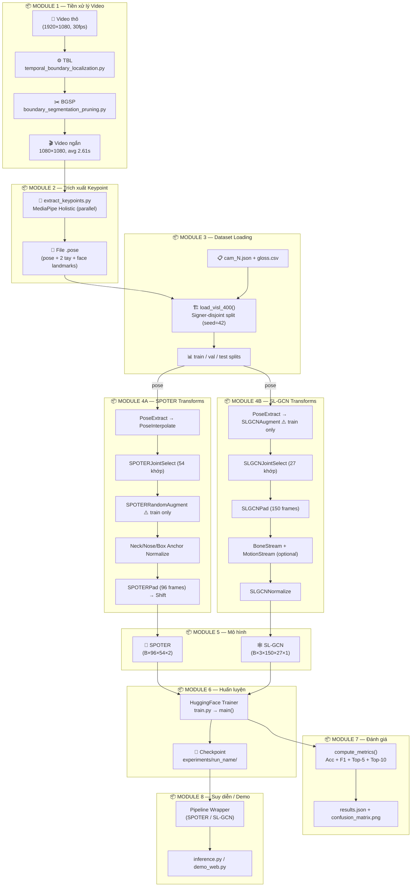

# Kiến trúc Pipeline — VSL Keypoint Pipeline

> Tài liệu mô tả kiến trúc end-to-end của pipeline nhận dạng Ngôn ngữ Ký hiệu Tiếng Việt (Isolated Word-Level VSL Recognition), từ video thô đến kết quả dự đoán.

---

## Mục lục

1. [Cấu trúc Thư mục](#1-cấu-trúc-thư-mục)
2. [Tổng quan Pipeline](#2-tổng-quan-pipeline)
3. [Module 1 — Tiền xử lý Video (TBL & BGSP)](#3-module-1--tiền-xử-lý-video-tbl--bgsp)
4. [Module 2 — Trích xuất Keypoint](#4-module-2--trích-xuất-keypoint)
5. [Module 3 — Nạp & Chia Dữ liệu](#5-module-3--nạp--chia-dữ-liệu)
6. [Module 4 — Transforms & Augmentation](#6-module-4--transforms--augmentation)
7. [Module 5 — Kiến trúc Mô hình](#7-module-5--kiến-trúc-mô-hình)
8. [Module 6 — Huấn luyện](#8-module-6--huấn-luyện)
9. [Module 7 — Đánh giá](#9-module-7--đánh-giá)
10. [Module 8 — Suy diễn & Demo](#10-module-8--suy-diễn--demo)
11. [Bảng tham số: Cố định / Thực nghiệm / Tùy chỉnh](#11-bảng-tham-số-cố-định--thực-nghiệm--tùy-chỉnh)
12. [Tính Mô đun & Khả năng Mở rộng](#12-tính-mô-đun--khả-năng-mở-rộng)

---

## 1. Cấu trúc Thư mục

```text
vsl-keypoint-pipeline/
│
├── docs/                          ← Tài liệu nghiên cứu và kỹ thuật
├── requirements.txt
├── Makefile
├── generate_ablation_configs.py   ← Tạo 19 file YAML cấu hình ablation
├── generate_ablation_report.py    ← Tổng hợp kết quả ablation thành báo cáo
├── run_ablation.py                ← Entrypoint chạy một run ablation cụ thể
│
├── experiments/
│   ├── ablation/                  ← Checkpoint mô hình từng ablation run
│   └── ablation_results/          ← File JSON kết quả từng run (dùng để tạo report)
│
└── src/                           ← Toàn bộ mã nguồn
    │
    ├── train.py                   ← Entrypoint huấn luyện
    ├── evaluate_model.py          ← Entrypoint đánh giá mô hình
    ├── inference.py               ← Entrypoint suy diễn offline (video/webcam)
    ├── preprocess_dataset.py      ← Xuất dataset keypoint đã xử lý (.npy)
    ├── extract_keypoints.py       ← Trích xuất .pose từ video thô
    ├── demo_web.py                ← Demo thời gian thực qua giao diện web
    ├── visualization.py           ← Tiện ích vẽ keypoint lên khung hình
    │
    ├── configs/                   ← Quản lý cấu hình & siêu tham số
    │   ├── arguments.py           ← Dataclass định nghĩa tất cả tham số
    │   ├── training/              ← YAML cấu hình huấn luyện
    │   ├── evaluation/            ← YAML cấu hình đánh giá
    │   ├── inference/             ← YAML cấu hình suy diễn
    │   └── ablation/              ← YAML tự động sinh cho 19 ablation runs
    │
    ├── data/                      ← Thuật toán tiền xử lý video
    │   ├── temporal_boundary_localization.py  ← Thuật toán TBL (Algorithm 1)
    │   ├── boundary_segmentation_pruning.py   ← Thuật toán BGSP (Algorithm 2)
    │   └── utils.py               ← State machine chuyển động tay, tính góc khớp
    │
    ├── features/                  ← DataLoader & pipeline transforms
    │   ├── base_dataset.py        ← Lớp BaseDataset trừu tượng
    │   ├── visl_400_dataset.py    ← VISL400Dataset: nạp video/pose files
    │   ├── pose_dataset.py        ← PoseDataset: PyTorch Dataset cho .pose/.npy
    │   ├── visl_400.py            ← Logic đọc metadata, chia train/val/test
    │   ├── utils.py               ← Điều phối lựa chọn transform pipeline
    │   │
    │   ├── transforms/            ← Chuẩn hóa & định hình đầu vào mô hình
    │   │   ├── base.py            ← PoseExtract (đọc .pose), PoseInterpolate
    │   │   ├── spoter.py          ← Joint select, normalize, pad, shift (SPOTER)
    │   │   └── sl_gcn.py          ← Joint select, pad, bone/motion stream (SL-GCN)
    │   │
    │   └── augmentations/         ← Tăng cường dữ liệu (chỉ dùng khi train)
    │       ├── spoter.py          ← Rotate, Shear, Perspective, ArmJointRotate, Noise
    │       └── sl_gcn.py          ← Rotation, shear, scale cho skeleton graph
    │
    ├── models/                    ← Kiến trúc mạng
    │   ├── spoter/
    │   │   ├── configuration.py   ← SPOTERConfig
    │   │   └── modelling.py       ← SPOTER Transformer + HuggingFace wrapper
    │   ├── sl_gcn/                ← SL-GCN (Spatial-Temporal GCN)
    │   └── videomae/              ← VideoMAE (RGB — fine-tuned từ Kinetics)
    │
    ├── pipelines/                 ← Đóng gói suy diễn chuẩn transformers.Pipeline
    │   ├── spoter_graph_classification.py
    │   ├── sl_gcn_graph_classification.py
    │   └── video_classification.py
    │
    ├── tools/                     ← Cầu nối nạp mô hình & dataset
    │   ├── models.py              ← load_model(), load_pipeline()
    │   └── features.py            ← load_dataset(), collate_fn
    │
    └── utils/                     ← Tiện ích chung
        ├── constants.py           ← Chỉ số khớp, danh sách model pose-based
        ├── metrics.py             ← Accuracy, F1, Top-K, FLOPs, confusion matrix
        ├── loggers.py             ← Logger & callback huấn luyện
        └── pose.py                ← Phân tích định dạng keypoint MediaPipe
```

---

## 2. Tổng quan Pipeline

Pipeline xử lý dữ liệu qua 8 module theo thứ tự sau:



---

## 3. Module 1 — Tiền xử lý Video (TBL & BGSP)

Pipeline tiền xử lý video đã chạy trước khi công bố dataset. Người dùng nhận file `.pose` không cần chạy lại bước này.

| Thành phần | File | Hàm chính |
| :--- | :--- | :--- |
| Phát hiện biên thời gian ký hiệu (TBL) | [temporal_boundary_localization.py](file:///Users/ngovietthanhbinh/Project/VSL_400/VietnameseSignLanguageRecognition/src/data/temporal_boundary_localization.py) | `process_getting_cut_time()` |
| Tính góc khuỷu tay | [temporal_boundary_localization.py](file:///Users/ngovietthanhbinh/Project/VSL_400/VietnameseSignLanguageRecognition/src/data/temporal_boundary_localization.py) | `calculate_angle(a, b, c)` |
| State machine trạng thái tay | [utils.py](file:///Users/ngovietthanhbinh/Project/VSL_400/VietnameseSignLanguageRecognition/src/data/utils.py) | Class `Arm`, `ok_to_get_frame()` |
| Cắt & crop video theo biên (BGSP) | [boundary_segmentation_pruning.py](file:///Users/ngovietthanhbinh/Project/VSL_400/VietnameseSignLanguageRecognition/src/data/boundary_segmentation_pruning.py) | `cut_crop_video()` |

**Tham số TBL đã sử dụng trong VSL400:**

| Tham số | Giá trị | Ý nghĩa |
| :--- | :--- | :--- |
| `θ` (angle threshold) | 160° | Ngưỡng góc khuỷu tay nhận diện trạng thái nghỉ |
| `τb` (buffer padding) | 400 ms | Thời gian đệm trước/sau điểm cắt |
| `N` (persistence) | 20 frames | Số frame duy trì trạng thái để lọc nhiễu |
| `visibility` | ≥ 0.6 | Ngưỡng tin cậy keypoint MediaPipe |
| `τmin` (min duration) | 0.67s | Độ dài tối thiểu clip sau cắt |
| `crop` | 1080×1080 | Kích thước chuẩn đầu ra |

> **Ghi chú:** Các tham số TBL chưa được tối ưu hóa bằng grid search đầy đủ. Ablation study (Phase 1) mới hoàn tất run θ=160°. Xem chi tiết tại [ablation_study_report.md](ablation_study_report.md).

---

## 4. Module 2 — Trích xuất Keypoint

| Thành phần | File | Hàm chính |
| :--- | :--- | :--- |
| Chuyển 1 video → file `.pose` | [extract_keypoints.py](file:///Users/ngovietthanhbinh/Project/VSL_400/VietnameseSignLanguageRecognition/src/extract_keypoints.py) | `process_video(video_path, overwrite)` |
| Xử lý batch song song | [extract_keypoints.py](file:///Users/ngovietthanhbinh/Project/VSL_400/VietnameseSignLanguageRecognition/src/extract_keypoints.py) | `main()` sử dụng `ThreadPoolExecutor` |
| Xuất dataset keypoint đã xử lý | [preprocess_dataset.py](file:///Users/ngovietthanhbinh/Project/VSL_400/VietnameseSignLanguageRecognition/src/preprocess_dataset.py) | `main()` → xuất file `.npy` |

File `.pose` chứa tọa độ đầy đủ MediaPipe Holistic: **33 pose keypoints + 21 tay trái + 21 tay phải + 468 face landmarks** (có confidence score cho mỗi điểm).

---

## 5. Module 3 — Nạp & Chia Dữ liệu

| Thành phần | File | Hàm chính |
| :--- | :--- | :--- |
| Đọc metadata JSON & tạo DataFrame | [visl_400.py](file:///Users/ngovietthanhbinh/Project/VSL_400/VietnameseSignLanguageRecognition/src/features/visl_400.py) | `load_visl_400(data_dict, gloss2id_file)` |
| Chia train/val/test (signer-disjoint) | [visl_400.py](file:///Users/ngovietthanhbinh/Project/VSL_400/VietnameseSignLanguageRecognition/src/features/visl_400.py) | Logic dòng 66–131 |
| Nạp file từ đĩa | [base_dataset.py](file:///Users/ngovietthanhbinh/Project/VSL_400/VietnameseSignLanguageRecognition/src/features/base_dataset.py) | `_load_from_local()` |
| API gọi từ train.py | [features.py](file:///Users/ngovietthanhbinh/Project/VSL_400/VietnameseSignLanguageRecognition/src/tools/features.py) | `load_dataset(data_config)` |

**Cơ chế chia dữ liệu (Signer-disjoint):** Signer trong validation và test không xuất hiện trong train. Đây là protocol kiểm tra khả năng tổng quát hóa sang người ký chưa thấy trong huấn luyện.

**Hỗ trợ 2 định dạng dữ liệu:**
- File `.pose` (raw): pipeline transform xử lý on-the-fly khi train.
- File `.npy` (đã tiền xử lý): nạp trực tiếp, bỏ qua transform, tăng tốc độ đáng kể.

---

## 6. Module 4 — Transforms & Augmentation

### 6.1 SPOTER Transforms

Thứ tự biến đổi cho mô hình SPOTER:

```
PoseExtract  →  PoseInterpolate  →  SPOTERJointSelect
    →  SPOTERRandomAugment (train only)
    →  AnchorNormalize (Neck/Nose/Box)  →  HandNormalize
    →  SPOTERPad (96 frames)  →  SPOTERShift
    →  GaussianNoise (train only)
```

| Thành phần | File | Mô tả |
| :--- | :--- | :--- |
| `PoseExtract` | [transforms/base.py](file:///Users/ngovietthanhbinh/Project/VSL_400/VietnameseSignLanguageRecognition/src/features/transforms/base.py) | Đọc file `.pose` thành Pose object |
| `PoseInterpolate` | [transforms/base.py](file:///Users/ngovietthanhbinh/Project/VSL_400/VietnameseSignLanguageRecognition/src/features/transforms/base.py) | Nội suy tuyến tính lấp đầy keypoint thiếu (confidence=0) |
| `SPOTERJointSelect` | [transforms/spoter.py](file:///Users/ngovietthanhbinh/Project/VSL_400/VietnameseSignLanguageRecognition/src/features/transforms/spoter.py) | Trích 54 khớp (12 body + 42 hand) — hoặc 74 nếu dùng face |
| `SPOTERSingleBodyDictNormalize` | [transforms/spoter.py](file:///Users/ngovietthanhbinh/Project/VSL_400/VietnameseSignLanguageRecognition/src/features/transforms/spoter.py) | Chuẩn hóa cơ thể theo điểm neo (Neck / Nose / Box) |
| `SPOTERSingleHandDictNormalize` | [transforms/spoter.py](file:///Users/ngovietthanhbinh/Project/VSL_400/VietnameseSignLanguageRecognition/src/features/transforms/spoter.py) | Chuẩn hóa bàn tay về gốc cổ tay |
| `SPOTERPad` | [transforms/spoter.py](file:///Users/ngovietthanhbinh/Project/VSL_400/VietnameseSignLanguageRecognition/src/features/transforms/spoter.py) | Cycle-pad hoặc truncate về 96 frames |
| `SPOTERShift` | [transforms/spoter.py](file:///Users/ngovietthanhbinh/Project/VSL_400/VietnameseSignLanguageRecognition/src/features/transforms/spoter.py) | Dịch tọa độ `[0,1]` → `[-0.5, 0.5]` |

**Augmentation (chỉ dùng khi train):**

| Kỹ thuật | Tham số | File |
| :--- | :--- | :--- |
| Xoay ngẫu nhiên | ±13°, p=0.3 | [augmentations/spoter.py](file:///Users/ngovietthanhbinh/Project/VSL_400/VietnameseSignLanguageRecognition/src/features/augmentations/spoter.py) |
| Squeeze ngang (Shear) | ≤15%, mode="squeeze" | [augmentations/spoter.py](file:///Users/ngovietthanhbinh/Project/VSL_400/VietnameseSignLanguageRecognition/src/features/augmentations/spoter.py) |
| Perspective Skew | hệ số 0.10, mode="perspective" | [augmentations/spoter.py](file:///Users/ngovietthanhbinh/Project/VSL_400/VietnameseSignLanguageRecognition/src/features/augmentations/spoter.py) |
| Xoay khớp tay (ArmJointRotate) | ±4°, p=0.3 | [augmentations/spoter.py](file:///Users/ngovietthanhbinh/Project/VSL_400/VietnameseSignLanguageRecognition/src/features/augmentations/spoter.py) |
| Gaussian Noise | std=0.001 | [augmentations/spoter.py](file:///Users/ngovietthanhbinh/Project/VSL_400/VietnameseSignLanguageRecognition/src/features/augmentations/spoter.py) |

### 6.2 SL-GCN Transforms

```
PoseExtract  →  SLGCNAugment (train only)  →  SLGCNJointSelect (27 khớp)
    →  SLGCNPad (150 frames)  →  BoneStream (optional)  →  MotionStream (optional)
    →  SLGCNNormalize
```

| Thành phần | File | Mô tả |
| :--- | :--- | :--- |
| `SLGCNJointSelect` | [transforms/sl_gcn.py](file:///Users/ngovietthanhbinh/Project/VSL_400/VietnameseSignLanguageRecognition/src/features/transforms/sl_gcn.py) | 27 khớp (7 body + 10L + 10R hand) |
| `SLGCNPad` | [transforms/sl_gcn.py](file:///Users/ngovietthanhbinh/Project/VSL_400/VietnameseSignLanguageRecognition/src/features/transforms/sl_gcn.py) | Pad về 150 frames → tensor `(C,T,V,M)` |
| `SLGCNBoneStream` | [transforms/sl_gcn.py](file:///Users/ngovietthanhbinh/Project/VSL_400/VietnameseSignLanguageRecognition/src/features/transforms/sl_gcn.py) | Vector liên kết xương `end - start` |
| `SLGCNMotionStream` | [transforms/sl_gcn.py](file:///Users/ngovietthanhbinh/Project/VSL_400/VietnameseSignLanguageRecognition/src/features/transforms/sl_gcn.py) | Tốc độ dịch chuyển `joint[t+1] - joint[t]` |
| `SLGCNNormalize` | [transforms/sl_gcn.py](file:///Users/ngovietthanhbinh/Project/VSL_400/VietnameseSignLanguageRecognition/src/features/transforms/sl_gcn.py) | Center subtraction |

---

## 7. Module 5 — Kiến trúc Mô hình

### 7.1 SPOTER

**Nguồn gốc:** Boháček & Hrúz, "Sign Pose-Based Transformer for Word-Level Sign Language Recognition", WACV Workshops 2022.

**Kiến trúc cốt lõi (giữ nguyên từ paper):**
- Transformer: `nhead=9`, `encoder_layers=6`, `decoder_layers=6`, `hidden_dim=108`
- Row Embedding (position encoding theo frame): `nn.Parameter(torch.rand(50, hidden_dim))`
- Class Query token (tương tự `[CLS]` của BERT): `nn.Parameter(torch.rand(1, hidden_dim))`
- Input shape: `(B, 96, 54, 2)`

**Tùy chỉnh trong dự án này:**
- **Loại bỏ Self-Attention trong Decoder Layer**: Giảm overfitting trên đặc trưng keypoint có tính lặp lại cao. Chi tiết tại [modelling.py](file:///Users/ngovietthanhbinh/Project/VSL_400/VietnameseSignLanguageRecognition/src/models/spoter/modelling.py) — `SPOTERTransformerDecoderLayer.forward()`.
- **Đóng gói qua `PreTrainedModel`**: Tích hợp với HuggingFace Trainer API.
- **FeatureExtractor động**: `num_frames` và `num_points` được lưu cùng checkpoint.

**Cải tiến tiền xử lý (theo Roh et al., 2024):**

| Kỹ thuật | Mô tả | Triển khai |
| :--- | :--- | :--- |
| Keypoint Interpolation | Nội suy tuyến tính lấp đầy tọa độ `(0,0)` có confidence thấp | `PoseInterpolate` — [transforms/base.py](file:///Users/ngovietthanhbinh/Project/VSL_400/VietnameseSignLanguageRecognition/src/features/transforms/base.py) |
| Neck Anchor Normalization | Gốc tọa độ về Cổ, scale theo khoảng cách Cổ–Mũi | `SPOTERSingleBodyDictNormalize(anchor="neck")` |
| Wrist Anchor (Hand) | Tọa độ bàn tay về gốc cổ tay | `SPOTERSingleHandDictNormalize` |
| 20 facial landmarks | Trích lọc vùng chân mày, mắt, môi từ 468 face mesh | `SPOTERJointSelect` với `face_landmarks=True` |

### 7.2 SL-GCN

**Kiến trúc:** Spatial-Temporal Graph Convolutional Network cho nhận dạng ngôn ngữ ký hiệu.
- Input: `(B, 3, 150, 27, 1)` — `(batch, channels, frames, joints, people)`
- Hỗ trợ 3 cấu hình khớp: `num_points ∈ {27, 31, 59}`
- Bone Stream và Motion Stream bật/tắt qua YAML

Mã nguồn SL-GCN nằm tại `src/models/sl_gcn/`. Tải cục bộ với `trust_remote_code=True` khi checkpoint chứa file `modelling.py` tùy chỉnh.

---

## 8. Module 6 — Huấn luyện

| Thành phần | File | Mô tả |
| :--- | :--- | :--- |
| Entrypoint huấn luyện | [train.py](file:///Users/ngovietthanhbinh/Project/VSL_400/VietnameseSignLanguageRecognition/src/train.py) | `main(args)` — gọi HuggingFace Trainer |
| Resume từ checkpoint | [train.py](file:///Users/ngovietthanhbinh/Project/VSL_400/VietnameseSignLanguageRecognition/src/train.py) | `train_with_checkpoint_compat(trainer, ckpt)` |
| Tính FLOPs & params | [metrics.py](file:///Users/ngovietthanhbinh/Project/VSL_400/VietnameseSignLanguageRecognition/src/utils/metrics.py) | `compute_flops_and_params(model, inputs)` |

**Cấu hình mặc định (ablation study):**

| Tham số | Giá trị |
| :--- | :--- |
| Epochs | 100 |
| Batch size (train) | 64 |
| Optimizer | AdamW, lr=5e-4, weight_decay=0.01 |
| LR schedule | Cosine decay, warmup_ratio=0.05 |
| Wandb | Disabled (`WANDB_MODE=disabled`) |

---

## 9. Module 7 — Đánh giá

| Thành phần | File | Mô tả |
| :--- | :--- | :--- |
| Tính metrics | [metrics.py](file:///Users/ngovietthanhbinh/Project/VSL_400/VietnameseSignLanguageRecognition/src/utils/metrics.py) | Accuracy, Macro F1, Recall, Precision |
| Top-K Accuracy | [metrics.py](file:///Users/ngovietthanhbinh/Project/VSL_400/VietnameseSignLanguageRecognition/src/utils/metrics.py) | `top_k_accuracy(eval_pred, k=5)` |
| Lưu kết quả | [metrics.py](file:///Users/ngovietthanhbinh/Project/VSL_400/VietnameseSignLanguageRecognition/src/utils/metrics.py) | `save_evaluation_results()` → `results.json` + confusion matrix |
| Entrypoint đánh giá | [evaluate_model.py](file:///Users/ngovietthanhbinh/Project/VSL_400/VietnameseSignLanguageRecognition/src/evaluate_model.py) | `main(args)` |

---

## 10. Module 8 — Suy diễn & Demo

| Thành phần | File | Mô tả |
| :--- | :--- | :--- |
| Nạp pipeline suy diễn | [tools/models.py](file:///Users/ngovietthanhbinh/Project/VSL_400/VietnameseSignLanguageRecognition/src/tools/models.py) | `load_pipeline(model_config, inference_config)` |
| Pipeline SPOTER | [pipelines/spoter_graph_classification.py](file:///Users/ngovietthanhbinh/Project/VSL_400/VietnameseSignLanguageRecognition/src/pipelines/spoter_graph_classification.py) | `SPOTERGraphClassificationPipeline` |
| Pipeline SL-GCN | [pipelines/sl_gcn_graph_classification.py](file:///Users/ngovietthanhbinh/Project/VSL_400/VietnameseSignLanguageRecognition/src/pipelines/sl_gcn_graph_classification.py) | `SLGCNGraphClassificationPipeline` |
| Suy diễn offline (video/file) | [inference.py](file:///Users/ngovietthanhbinh/Project/VSL_400/VietnameseSignLanguageRecognition/src/inference.py) | `inference(config, pipeline)` |
| Demo webcam thời gian thực | [demo_web.py](file:///Users/ngovietthanhbinh/Project/VSL_400/VietnameseSignLanguageRecognition/src/demo_web.py) | Class `RealtimeRecognizer`, HTTP handler |

---

## 11. Bảng tham số: Cố định / Thực nghiệm / Tùy chỉnh

> **Chú giải:**
> - 🟩 **Cố định**: Thuộc cốt lõi kiến trúc paper gốc — không nên thay đổi để tránh phá vỡ cấu trúc.
> - 🔵 **Tùy chỉnh**: Dự án này thêm vào — có thể điều chỉnh với hiểu biết đầy đủ.
> - 🟥 **Thực nghiệm**: Tìm ra qua ablation — có thể fine-tune thêm.
> - 🟦 **Tùy chọn**: Bật/tắt qua file YAML.

| Tham số | Loại | Khả năng điều chỉnh |
| :--- | :--- | :--- |
| SPOTER: 9 heads, 6 enc/dec layers | 🟩 Cố định | ❌ Không thay đổi (phá vỡ tương thích checkpoint) |
| SPOTER: `hidden_dim=108` | 🟩 Cố định | ⚠️ Thay đổi sẽ làm mất khả năng load checkpoint cũ |
| SPOTER: `num_frames=96` | 🟥 Thực nghiệm | ✅ Thử nghiệm 64, 128, 150 |
| SPOTER: `aug_prob=0.3` | 🟥 Thực nghiệm | ✅ Thử 0.2–0.5 |
| SPOTER: Gaussian `std=0.001` | 🟥 Thực nghiệm | ✅ Thử 0.0005–0.005 |
| SPOTER: Bỏ Self-Attention Decoder | 🔵 Tùy chỉnh | ✅ Có thể bật lại để đối chứng |
| SPOTER: Anchor normalization | 🔵 Tùy chỉnh | ✅ Cấu hình `anchor: "neck"/"nose"/"box"` trong YAML |
| SL-GCN: `num_points=27` | 🟥 Thực nghiệm | ✅ Hỗ trợ 31, 59 khớp |
| SL-GCN: `bone_stream=False` | 🟦 Tùy chọn | ✅ Bật để học tương quan xương |
| SL-GCN: `motion_stream=False` | 🟦 Tùy chọn | ✅ Bật để học tốc độ chuyển động |
| TBL: `θ=160°` | 🟥 Thực nghiệm | ✅ Thử 140°–170° (xem ablation Phase 1) |
| TBL: `τb=400ms` | 🟥 Thực nghiệm | ✅ Thử 200ms–600ms |
| TBL: `N=20 frames` | 🟥 Thực nghiệm | ✅ Thử 10–30 frames |
| Dataset: Signer-disjoint split | 🔵 Tùy chỉnh | ⚠️ Thay đổi protocol ảnh hưởng toàn bộ so sánh |

---

## 12. Tính Mô đun & Khả năng Mở rộng

### Sơ đồ phụ thuộc module

```
[M1: TBL/BGSP] → [M2: Keypoint] → [M3: Dataset Loading]
                                          │
                          ┌───────────────┼───────────────┐
                          ▼               ▼               ▼
                    [M4A SPOTER]    [M4B SL-GCN]    [M4C RGB*]
                          │               │
                          ▼               ▼
                    [M5: SPOTER]    [M5: SL-GCN]
                          │
                          ▼
                    [M6: Training] → [M7: Evaluation]
                          │
                          └──────────────────────► [M8: Inference/Demo]
```

*\* Module RGB (VideoMAE) có trong codebase nhưng không dùng trong ablation study chính.*

### Điểm mở rộng chính

| Muốn thêm... | Cần làm |
| :--- | :--- |
| Dataset mới | Kế thừa [BaseDataset](file:///Users/ngovietthanhbinh/Project/VSL_400/VietnameseSignLanguageRecognition/src/features/base_dataset.py), implement `_load_from_local()` |
| Kiến trúc mô hình mới | Thêm class vào `src/models/`, đăng ký trong [tools/models.py](file:///Users/ngovietthanhbinh/Project/VSL_400/VietnameseSignLanguageRecognition/src/tools/models.py) `load_model()` |
| Transform mới | Thêm class vào `src/features/transforms/`, đăng ký trong [features/utils.py](file:///Users/ngovietthanhbinh/Project/VSL_400/VietnameseSignLanguageRecognition/src/features/utils.py) |
| Metric mới | Thêm vào [utils/metrics.py](file:///Users/ngovietthanhbinh/Project/VSL_400/VietnameseSignLanguageRecognition/src/utils/metrics.py) `compute_metrics()` |
| Pipeline suy diễn mới | Kế thừa `transformers.Pipeline`, đăng ký trong [tools/models.py](file:///Users/ngovietthanhbinh/Project/VSL_400/VietnameseSignLanguageRecognition/src/tools/models.py) `load_pipeline()` |

### Điểm kết nối then chốt (Integration Points)

1. **Lựa chọn transform pipeline**: [`features/utils.py`](file:///Users/ngovietthanhbinh/Project/VSL_400/VietnameseSignLanguageRecognition/src/features/utils.py) → `get_pose_transforms()` → `_get_spoter_transforms()` / `_get_sl_gcn_transforms()`
2. **Khởi tạo mô hình**: [`tools/models.py`](file:///Users/ngovietthanhbinh/Project/VSL_400/VietnameseSignLanguageRecognition/src/tools/models.py) → `load_model()`
3. **Chọn collate function**: [`train.py`](file:///Users/ngovietthanhbinh/Project/VSL_400/VietnameseSignLanguageRecognition/src/train.py) tự chọn `rgb_collate_fn` / `pose_collate_fn` theo modality
4. **Danh sách model pose-based**: [`utils/constants.py`](file:///Users/ngovietthanhbinh/Project/VSL_400/VietnameseSignLanguageRecognition/src/utils/constants.py) → `POSE_BASED_MODELS`

---

*Xem kết quả thực nghiệm đầy đủ tại [ablation_study_report.md](ablation_study_report.md).*
