# Phân tích Kiến trúc Toàn diện — Dự án VSL400

> Kết hợp phân tích source code + bài báo VSL400 Dataset (2026)

---

## Mục lục
1. [Cấu trúc thư mục & Chức năng từng file](#1-cấu-trúc-thư-mục)
2. [Pipeline trực quan hóa (Module Map)](#2-pipeline-trực-quan-hóa)
3. [Source code tương ứng từng khối Pipeline](#3-source-code-tương-ứng-từng-khối)
4. [Phân tích kỹ thuật từng Model](#4-phân-tích-kỹ-thuật-từng-model)
5. [Bảng tổng hợp: Cố định / Thực nghiệm / Tinh chỉnh được](#5-bảng-tổng-hợp)
6. [Tính Module hóa & Khả năng hoán đổi](#6-tính-module-hóa)

---

## 1. Cấu trúc Thư mục

```
VietnameseSignLanguageRecognition/
│
├── data/                          ← Dữ liệu thô & đã xử lý (KHÔNG commit lên git)
│   └── processed/vsl_400/
│       ├── cam_1/                 ← Video + .pose files từng camera
│       ├── cam_1.json             ← Metadata (video_id, signer_id, gloss, fps...)
│       └── gloss.csv              ← Ánh xạ gloss→id (400 nhãn)
│
├── experiments/                   ← Checkpoint mô hình sau training
│   └── spoter_m4_cam1/
│
├── demo/                          ← Output của inference/demo
│   └── spoter_m4_cam1_webcam/
│       └── demo_web_results.csv   ← Kết quả demo webcam
│
├── docs/                          ← Tài liệu dự án
│
├── requirements.txt
├── Makefile
│
└── src/                           ← TẤT CẢ source code
    │
    ├── train.py                   ← [Entrypoint] Khởi chạy training
    ├── inference.py               ← [Entrypoint] Suy diễn từ video/webcam offline
    ├── evaluate_model.py          ← [Entrypoint] Đánh giá model trên dataset
    ├── extract_keypoints.py       ← [Entrypoint] Trích xuất .pose từ video
    ├── demo_web.py                ← [Entrypoint] Demo realtime qua trình duyệt web
    ├── visualization.py           ← [Util] Vẽ text lên frame ảnh
    │
    ├── configs/                   ← Cấu hình & tham số
    │   ├── arguments.py           ← Định nghĩa tất cả dataclass config
    │   ├── training/
    │   │   ├── spoter.yaml        ← Cấu hình training SPOTER (thực nghiệm)
    │   │   └── videomae_s.yaml    ← Cấu hình training VideoMAE
    │   ├── inference/
    │   │   ├── spoter.yaml
    │   │   ├── spoter_m4_cam1.yaml
    │   │   └── videomae_s.yaml
    │   └── evaluation/
    │       ├── spoter.yaml
    │       └── videomae_s.yaml
    │
    ├── data/                      ← Tiền xử lý video thô
    │   ├── temporal_boundary_localization.py  ← Thuật toán TBL (Algorithm 1 paper)
    │   ├── boundary_segmentation_pruning.py   ← Thuật toán BGSP (Algorithm 2 paper)
    │   └── utils.py               ← Class Arm, ok_to_get_frame(), calculate_angle()
    │
    ├── features/                  ← Dataset loader + Feature extraction
    │   ├── base_dataset.py        ← Abstract BaseDataset (Đọc dữ liệu cục bộ)
    │   ├── visl_400_dataset.py    ← VISL400Dataset (kế thừa BaseDataset)
    │   ├── pose_dataset.py        ← PoseDataset (PyTorch Dataset cho .pose)
    │   ├── utils.py               ← get_rgb_transforms(), get_pose_transforms()
    │   │
    │   ├── hf_builders/
    │   │   └── visl_400.py        ← load_visl_400() — đọc JSON, split train/val/test
    │   │
    │   ├── transforms/            ← Biến đổi dữ liệu (normalize, không augment)
    │   │   ├── spoter.py          ← SPOTERJointSelect, Pad, BodyNorm, HandNorm, Shift
    │   │   ├── sl_gcn.py          ← SLGCNJointSelect, Pad, BoneStream, MotionStream
    │   │   └── base.py            ← PoseExtract (đọc .pose → Pose object)
    │   │
    │   └── augmentations/         ← Data augmentation (CHỈ khi train)
    │       ├── spoter.py          ← SPOTERRotate, Shear, ArmJointRotate, GaussianNoise
    │       └── sl_gcn.py          ← SLGCNAugment (rotation/shear/scale)
    │
    ├── models/                    ← Kiến trúc mô hình
    │   ├── spoter/
    │   │   ├── configuration.py   ← SPOTERConfig
    │   │   └── modelling.py       ← SPOTER(nn.Module), SPOTERForGraphClassification
    │   └── videomae/
    │       ├── configuration.py   ← VideoMAEConfig
    │       └── modelling.py       ← VideoMAEForVideoClassification
    │
    ├── pipelines/                 ← Pipeline wrappers kế thừa transformers.Pipeline
    │   ├── spoter_graph_classification.py
    │   ├── sl_gcn_graph_classification.py
    │   └── video_classification.py
    │
    ├── tools/                     ← Helper functions cầu nối train/infer
    │   ├── models.py              ← load_model(), load_pipeline(), Predictions class
    │   └── features.py            ← load_dataset(), rgb_collate_fn(), pose_collate_fn()
    │
    └── utils/                     ← Tiện ích chung
        ├── constants.py           ← POSE_BASED_MODELS, landmark lists, SLGCN_JOINTS
        ├── metrics.py             ← compute_metrics(), save_evaluation_results()
        ├── loggers.py             ← config_logger(), TrainingCallback
        └── pose.py                ← parse_keypoints()
```

---

## 2. Pipeline Trực quan hóa

### Sơ đồ tổng thể 8 Module

```mermaid
flowchart TD
    subgraph M1["📦 MODULE 1 — Tiền xử lý Video Offline"]
        direction TB
        A["🎥 Video thô\n1920×1080, 30fps\n3 góc camera"]
        B["⚙️ TBL\ntemporal_boundary_localization.py\nprocess_getting_cut_time()"]
        C["📄 cut_time.csv\nstart_time, end_time"]
        D["✂️ BGSP\nboundary_segmentation_pruning.py\ncut_crop_video()"]
        E["🎬 Video ngắn\n1080×1080, avg 2.61s\ncam_1/00001.mp4"]
        A --> B --> C --> D --> E
    end

    subgraph M2["📦 MODULE 2 — Trích xuất Khung xương"]
        F["🦴 extract_keypoints.py\nprocess_video() × ThreadPoolExecutor\nvideo_to_pose CLI (MediaPipe Holistic)"]
        G["📐 File .pose\nMediaPipe Holistic format\n(pose + 2 tay + face)"]
        E --> F --> G
    end

    subgraph M3["📦 MODULE 3 — Dataset Loading & Splitting"]
        H["📋 cam_N.json\n(gloss.csv tùy chọn)"]
        I["🏗️ load_visl_400()\nhf_builders/visl_400.py\nSigner-disjoint split"]
        J["📊 train / val / test DataFrames\n(shuffled seed=42)"]
        G & H --> I --> J
    end

    subgraph M4A["📦 MODULE 4A — SPOTER Transforms"]
        K1["📖 PoseExtract()\nload_holistic() → Pose"]
        K2["🔍 SPOTERJointSelect()\n54 khớp (12 body + 42 hand)"]
        K3["📦 TensorToDict()"]
        K4["🎲 SPOTERRandomAugment(p=0.3)\nRotate±13° / Shear15% / ArmJoint±4°\n⚠️ CHỈ KHI TRAIN"]
        K5["📏 BodyNormalize()\nShoulder distance → [0,1]"]
        K6["✋ HandNormalize()\nPer-hand bounding box → [0,1]"]
        K7["🔢 DictToTensor()"]
        K8["📐 SPOTERPad(96 frames)\nCycle-pad hoặc truncate"]
        K9["➡️ SPOTERShift()\n0,1 → -0.5,0.5"]
        K10["🌊 GaussianNoise(std=0.001)\n⚠️ CHỈ KHI TRAIN"]
        K1-->K2-->K3-->K4-->K5-->K6-->K7-->K8-->K9-->K10
    end

    subgraph M4B["📦 MODULE 4B — SL-GCN Transforms"]
        L1["📖 PoseExtract()\n+ normalize_distribution()"]
        L2["🎲 SLGCNAugment(p=0.5)\nrotation / shear / scale\n⚠️ CHỈ KHI TRAIN"]
        L3["🔍 SLGCNJointSelect(27 pts)\n7 body + 10L + 10R hand"]
        L4["📐 SLGCNPad(150 frames)\n→ C,T,V,M shape"]
        L5["🦴 BoneStream()\n⚙️ TÙY CHỌN"]
        L6["⚡ MotionStream()\n⚙️ TÙY CHỌN"]
        L7["📏 SLGCNNormalize()\nCenter subtraction"]
        L8["🔢 NumPyToTensor()"]
        L1-->L2-->L3-->L4-->L5-->L6-->L7-->L8
    end

    subgraph M4C["📦 MODULE 4C — RGB Transforms VideoMAE"]
        M1_["🎥 Video frames"]
        M2_["🎲 AugMix / MixUp\n⚠️ CHỈ KHI TRAIN"]
        M3_["📐 UniformSubsample 16f\nDiv255 + Normalize + Resize + CenterCrop"]
        M1_-->M2_-->M3_
    end

    subgraph M5["📦 MODULE 5 — Model Architecture"]
        N1["🤖 SPOTER\nTransformer: 9 heads, 6 enc/dec layers\nhidden_dim=108\nInput: B×96×54×2"]
        N2["🕸️ SL-GCN\nSpatial-Temporal GCN\nInput: B×3×150×27×1"]
        N3["🎬 VideoMAE-Small\nViT pretrained Kinetics\nInput: B×16×3×224×224"]
    end

    subgraph M6["📦 MODULE 6 — Training"]
        O["🏋️ HuggingFace Trainer\ntrain.py → main()\n(Wandb/Hub disabled)"]
        P["💾 Checkpoint\nexperiments/run_name/"]
        O --> P
    end

    subgraph M7["📦 MODULE 7 — Evaluation"]
        Q["📊 compute_metrics()\nAccuracy + F1 + Recall + Precision\n+ Top-5 + Top-10"]
        R["📈 save_evaluation_results()\nresults.json + confusion_matrix.png"]
        Q --> R
    end

    subgraph M8["📦 MODULE 8 — Inference / Demo"]
        S1["🖥️ inference.py\nVideo file / Webcam offline"]
        S2["🌐 demo_web.py\nRealtime Web HTTP Server"]
        T["📡 Pipeline Wrapper\n(SPOTER / SL-GCN / VideoMAE)\nTải ONNX cục bộ từ checkpoint"]
        U["📋 Top-K Predictions\n{gloss, score}"]
        T --> S1 & S2 --> U
    end

    J -->|pose modality| K1
    J -->|pose modality| L1
    J -->|rgb modality| M1_
    K10 -->|"(B,96,54,2)"| N1
    L8 -->|"(B,3,150,27,1)"| N2
    M3_ -->|"(B,16,3,H,W)"| N3
    N1 & N2 & N3 --> O
    O --> Q
    P --> T
```



---

## 3. Source Code Tương ứng Từng Khối

### MODULE 1 — TBL & BGSP

| Khối | File | Hàm cụ thể |
|---|---|---|
| Chuẩn hóa video (fps, resolution) | `src/data/temporal_boundary_localization.py` | `normalize_video()`, `process_normalizing_quality()` |
| **TBL — phát hiện boundary** | `src/data/temporal_boundary_localization.py` | `process_getting_cut_time()` |
| Tính góc khuỷu tay | `src/data/temporal_boundary_localization.py` | `calculate_angle(a, b, c)` |
| State machine tay lên/xuống | `src/data/utils.py` | `class Arm`, `ok_to_get_frame()` |
| Ghi CSV ranh giới thời gian | `src/data/temporal_boundary_localization.py` | `save_to_csv()` |
| **BGSP — cắt & crop video** | `src/data/boundary_segmentation_pruning.py` | `cut_crop_video()` |
| Xử lý batch BGSP | `src/data/boundary_segmentation_pruning.py` | `process_cutting_cropping_video()` |

### MODULE 2 — Keypoint Extraction

| Khối | File | Hàm cụ thể |
|---|---|---|
| Xử lý 1 video → .pose | `src/extract_keypoints.py` | `process_video(video_path, overwrite)` |
| Parallel batch processing | `src/extract_keypoints.py` | `main()` + `ThreadPoolExecutor` |
| Gọi CLI tool | `src/extract_keypoints.py` | `subprocess.run([video_to_pose_cmd, ...])` |

### MODULE 3 — Dataset Loading

| Khối | File | Hàm cụ thể |
|---|---|---|
| Đọc JSON + tạo split | `src/features/hf_builders/visl_400.py` | `load_visl_400(data_dict, gloss2id_file)` (gloss.csv tùy chọn) |
| Logic signer-disjoint | `src/features/hf_builders/visl_400.py` | Lines 66–131 (signer ID assignment) |
| Load local data | `src/features/base_dataset.py` | `_load_from_local()` |
| Entry point từ train.py | `src/tools/features.py` | `load_dataset(data_config)` |
| Tạo PyTorch dataset split | `src/features/base_dataset.py` | `get_split(split, processor)` |

### MODULE 4A — SPOTER Transforms

| Khối | File | Hàm/Class cụ thể |
|---|---|---|
| Đọc file .pose | `src/features/transforms/base.py` | `PoseExtract.__call__()` → `load_holistic()` |
| Lọc 54 khớp | `src/features/transforms/spoter.py` | `SPOTERJointSelect.__call__()` |
| Tensor → Dict | `src/features/transforms/spoter.py` | `SPOTERTensorToDict.__call__()` |
| Augment tổng hợp | `src/features/augmentations/spoter.py` | `SPOTERRandomAugment.__call__()` |
| Augment: Rotate ±13° | `src/features/augmentations/spoter.py` | `SPOTERRotate.__call__()` |
| Augment: Shear 15% | `src/features/augmentations/spoter.py` | `SPOTERShear.__call__("squeeze")` |
| Augment: ArmJointRotate | `src/features/augmentations/spoter.py` | `SPOTERArmJointRotate.__call__()` |
| Body normalization | `src/features/transforms/spoter.py` | `SPOTERSingleBodyDictNormalize.__call__()` |
| Hand normalization | `src/features/transforms/spoter.py` | `SPOTERSingleHandDictNormalize.__call__()` |
| Dict → Tensor | `src/features/transforms/spoter.py` | `SPOTERDictToTensor.__call__()` |
| Pad/Truncate frames | `src/features/transforms/spoter.py` | `SPOTERPad.__call__(num_frames=96)` |
| Shift [-0.5, 0.5] | `src/features/transforms/spoter.py` | `SPOTERShift.__call__()` |
| Gaussian noise | `src/features/augmentations/spoter.py` | `SPOTERGaussianNoise.__call__()` |
| **Kết nối toàn bộ** | `src/features/utils.py` | `_get_spoter_transforms(split, processor, config)` |

### MODULE 4B — SL-GCN Transforms

| Khối | File | Hàm/Class cụ thể |
|---|---|---|
| Đọc .pose | `src/features/transforms/base.py` | `PoseExtract.__call__()` |
| Augment 2D | `src/features/augmentations/sl_gcn.py` | `SLGCNAugment.__call__()` → `pose.augment2d()` |
| Lọc khớp theo graph | `src/features/transforms/sl_gcn.py` | `SLGCNJointSelect.__call__()` |
| Pad + transpose shape | `src/features/transforms/sl_gcn.py` | `SLGCNPad.__call__()` |
| Bone stream (optional) | `src/features/transforms/sl_gcn.py` | `SLGCNBoneStream.__call__()` |
| Motion stream (optional) | `src/features/transforms/sl_gcn.py` | `SLGCNMotionStream.__call__()` |
| Center normalization | `src/features/transforms/sl_gcn.py` | `SLGCNNormalize.__call__()` |
| **Kết nối toàn bộ** | `src/features/utils.py` | `_get_sl_gcn_transforms(split, processor, config)` |

### MODULE 5 — Model

| Khối | File | Hàm/Class cụ thể |
|---|---|---|
| SPOTER Transformer core | `src/models/spoter/modelling.py` | `class SPOTER(nn.Module)` |
| SPOTER decoder tùy chỉnh | `src/models/spoter/modelling.py` | `SPOTERTransformerDecoderLayer.forward()` |
| SPOTER + HF wrapper | `src/models/spoter/modelling.py` | `SPOTERForGraphClassification(PreTrainedModel)` |
| SPOTER feature extractor | `src/models/spoter/modelling.py` | `SPOTERFeatureExtractor(FeatureExtractionMixin)` |
| SPOTER config | `src/models/spoter/configuration.py` | `SPOTERConfig` |
| VideoMAE wrapper | `src/models/videomae/modelling.py` | `VideoMAEForVideoClassification` |
| Load model cho training | `src/tools/models.py` | `load_model()`, `load_pose_model_for_training()` |

### MODULE 6 — Training

| Khối | File | Hàm cụ thể |
|---|---|---|
| Entry point | `src/train.py` | `main(args)` (Wandb/HF Hub upload đã lược bỏ) |
| Tính FLOPs/params | `src/utils/metrics.py` | `compute_flops_and_params(model, inputs)` |
| HuggingFace Trainer setup | `src/train.py` | `Trainer(model, args, train_dataset, ...)` |
| Resume checkpoint | `src/train.py` | `train_with_checkpoint_compat(trainer, ckpt)` |
| Lưu model | `src/train.py` | `trainer.save_model()` |

### MODULE 7 — Evaluation

| Khối | File | Hàm cụ thể |
|---|---|---|
| Tính metrics | `src/utils/metrics.py` | `compute_metrics(eval_pred)` |
| Top-K accuracy | `src/utils/metrics.py` | `top_k_accuracy(eval_pred, k=5)` |
| Lưu kết quả | `src/utils/metrics.py` | `save_evaluation_results(results, classes, output_dir)` |
| Confusion matrix | `src/utils/metrics.py` | `compute_confusion_matrix()` |
| Standalone evaluation | `src/evaluate_model.py` | `main(args)` |

### MODULE 8 — Inference / Demo

| Khối | File | Hàm/Class cụ thể |
|---|---|---|
| Tải pipeline | `src/tools/models.py` | `load_pipeline(model_config, inference_config)` |
| SPOTER inference | `src/pipelines/spoter_graph_classification.py` | `SPOTERGraphClassificationPipeline` |
| SL-GCN inference | `src/pipelines/sl_gcn_graph_classification.py` | `SLGCNGraphClassificationPipeline` |
| Online boundary detection | `src/data/utils.py` | `ok_to_get_frame()`, `get_sample_timestamp()` |
| Offline inference loop | `src/inference.py` | `inference(config, pipeline)` |
| **Realtime Web App** | `src/demo_web.py` | `class RealtimeRecognizer` |
| Web HTTP handler | `src/demo_web.py` | `make_handler(recognizer)` → `DemoHandler` |
| Predict 1 sample | `src/demo_web.py` | `RealtimeRecognizer._predict()` |
| Lưu CSV kết quả | `src/demo_web.py` | `RealtimeRecognizer.save_results()` |

---

## 4. Phân tích Kỹ thuật Từng Model

### 4.1 Model SPOTER

#### 🟩 NGUYÊN GỐC từ bài báo SPOTER (Bohácek & Hrúz, 2022)

| Kỹ thuật | Giá trị | Code |
|---|---|---|
| Transformer architecture | `nhead=9, encoder_layers=6, decoder_layers=6` | `SPOTER.__init__()` |
| Row embedding (positional) | `nn.Parameter(torch.rand(50, hidden_dim))` | `self.row_embed` |
| Class query | `nn.Parameter(torch.rand(1, hidden_dim))` | `self.class_query` |
| Body normalization | Shoulder distance làm head metric | `SPOTERSingleBodyDictNormalize` |
| Hand normalization | Per-hand bounding box, delta = 10% | `SPOTERSingleHandDictNormalize` |
| Shift coordinates | [0,1] → [-0.5, 0.5] | `SPOTERShift` |
| Augment: Rotate | ±13° quanh tâm (0.5, 0.5) | `SPOTERRotate` |
| Augment: Squeeze | Nén 2 phía tối đa 15% width | `SPOTERShear("squeeze")` |
| Augment: ArmJointRotate | p=30%, ±4° cho từng khớp cánh tay | `SPOTERArmJointRotate` |

#### 🔵 TÙYCHỈNH của project này (khác gốc)

| Thay đổi | Lý do | Code |
|---|---|---|
| **Xóa self-attention trong decoder** | Giảm overfitting, "redundant self-attention" | `SPOTERTransformerDecoderLayer.forward()` — bỏ `tgt2 = self.self_attn(tgt,...)` |
| **PreTrainedModel wrapper** | Tích hợp PyTorch / HF Trainer (Hub push tắt) | `SPOTERForGraphClassification(PreTrainedModel)` |
| **Gaussian Noise augment** | Thêm robustness — không có trong SPOTER gốc | `SPOTERGaussianNoise` |
| **FeatureExtractor config** | Lưu num_frames, num_points với model | `SPOTERFeatureExtractor` |

#### 🟥 THỰC NGHIỆM (từ paper VSL400 + config)

| Thông số | Giá trị training | Default code |
|---|---|---|
| `num_frames` | **96** | 150 |
| `hidden_dim` | 108 | 108 (gốc SPOTER) |
| `learning_rate` | **5e-4** | 5e-5 |
| `lr_scheduler_type` | **cosine** | linear |
| `warmup_ratio` | **0.05** | 0.1 |
| `num_train_epochs` | **100** | 10 |
| `batch_size` | **64 / 128** | 8 |
| `aug_prob` | **0.3** | 0.5 |
| `gaussian_noise_std` | **0.001** | — |
| `weight_decay` | **0.01** | 0 |

---

### 4.2 Model SL-GCN

#### 🟩 NGUYÊN GỐC từ SL-GCN (Bai et al.)

| Kỹ thuật | Mô tả |
|---|---|
| Spatial-Temporal GCN | Graph convolution trên skeleton với adjacency matrix |
| Input shape | `(batch, channels=3, frames=150, joints, people=1)` |
| Bone Stream | `bone_vec = joint_end - joint_start` theo 26 pairs |
| Motion Stream | `motion[t] = joint[t+1] - joint[t]`, frame cuối = 0 |
| normalize_distribution() | Normalize toàn bộ pose sang phân phối chuẩn |

#### 🔵 TÙYCHỈNH

| Thay đổi | Lý do / Chi tiết | Code |
|---|---|---|
| **3 bộ khớp tuỳ chọn: 27/31/59** | Cấu hình qua `num_points` | `SLGCN_JOINTS` trong `constants.py` |
| **Bone/Motion Stream là TÙY CHỌN** | Bật/tắt linh hoạt qua flag | `processor.bone_stream`, `processor.motion_stream` |
| **Augment 2D qua pose_format** | Tăng cường dữ liệu xương | `SLGCNAugment` → `pose.augment2d(rotation_std=0.2)` |
| **Tải động qua HF Hub / ONNX** | Loại bỏ code model cục bộ (chỉ giữ code transform/pipeline). Load qua `trust_remote_code=True` khi suy diễn/đánh giá | `load_model()` / `AutoModel.from_pretrained` |

#### 🟥 THỰC NGHIỆM

| Thông số | Giá trị default | Có thể thay |
|---|---|---|
| `num_points` | 27 | 31, 59 |
| `num_frames` | 150 | 96, 120 |
| `bone_stream` | False | True |
| `motion_stream` | False | True |
| `rotation_std` | 0.2 | 0.1–0.4 |
| `shear_std` | 0.2 | 0.1–0.4 |
| `scale_std` | 0.2 | 0.1–0.4 |

---

### 4.3 Model VideoMAE (RGB)

#### 🟩 NGUYÊN GỐC (Pre-trained trên Kinetics-400)

| Kỹ thuật | Mô tả |
|---|---|
| Video Masked Autoencoder | ViT backbone, self-supervised pre-training |
| Pretrained weights | `MCG-NJU/videomae-small-finetuned-kinetics` |
| AugMix parameters | `magnitude=3, alpha=1.0, width=5, depth=-1` |

#### 🔵 FINE-TUNE cho VSL

| Thay đổi | Mô tả |
|---|---|
| Classification head | Thay 400 Kinetics classes → 400 VSL classes |
| `learning_rate=5e-5` | Nhỏ hơn SPOTER để bảo toàn pretrained features |

---

### 4.4 Thuật toán TBL/BGSP — Thông số từ Paper

Bài báo VSL400 (2026) ghi rõ đây là các thông số "**empirically optimized**":

| Thông số | Giá trị trong paper | Cờ CLI | Code |
|---|---|---|---|
| `θ` (angle threshold) | **160°** — phân biệt tay "nghỉ" vs "hoạt động" | `--threshold 160` | `calculate_angle()` so với 160 |
| `τb` (buffer padding) | **400ms** — thêm context trước/sau ký hiệu | `--delay 400` | `cap.get(POS_MSEC) ± delay` |
| `N` (persistence frames) | **20 frames** — chống nhiễu | `--min_up_frame 20` | `num_up_frames == min_up_frames` |
| `visibility threshold` | **0.6** | Hardcoded | `landmarks[idx].visibility >= 0.6` |
| `τmin` (min duration) | **0.67s** — loại clip quá ngắn | Implicit trong BGSP | `end_time - start_time < 0.67` |
| `xoffset` | **420px** — crop offset ngang | `--crop_dimensions 1080:1080:420:0` | `frame[y:y+h, x:x+w]` |
| `crop_size` | **1080×1080** | `--crop_dimensions 1080:1080:420:0` | `VideoWriter(..., (w, h))` |

---

## 5. Bảng Tổng Hợp

### Chú giải:
- 🟩 **Cố định gốc** — Lấy trực tiếp từ bài báo model gốc, không nên thay đổi
- 🔵 **Tùychỉnh** — Modification cụ thể của project, có lý do thiết kế rõ ràng
- 🟥 **Thực nghiệm** — Được optimize thực nghiệm, bạn có thể thử giá trị khác
- 🟦 **Tùy chọn** — Feature bật/tắt được, không ảnh hưởng kiến trúc cơ bản

| Component | Loại | Bạn có thể thay đổi? |
|---|---|---|
| SPOTER: 9 heads, 6 layers | 🟩 Cố định gốc | ❌ |
| SPOTER: hidden_dim=108 | 🟩 Cố định gốc | ⚠️ Phá vỡ pretrained weights |
| SPOTER: Body/Hand normalization | 🟩 Cố định gốc | ❌ |
| SPOTER: Shift [-0.5, 0.5] | 🟩 Cố định gốc | ❌ |
| SPOTER: Rotate ±13°, Squeeze 15% | 🟩 Cố định gốc | ⚠️ Có thể thử nhẹ hơn/mạnh hơn |
| SPOTER: Xóa self-attention decoder | 🔵 Tùychỉnh | ✅ Thử bật lại để so sánh |
| SPOTER: num_frames=96 | 🟥 Thực nghiệm | ✅ Thử 64, 128, 150 |
| SPOTER: aug_prob=0.3 | 🟥 Thực nghiệm | ✅ Thử 0.2–0.5 |
| SPOTER: gaussian_noise_std=0.001 | 🟥 Thực nghiệm | ✅ Thử 0.0005–0.005 |
| SPOTER: lr=5e-4, cosine, warmup=0.05 | 🟥 Thực nghiệm | ✅ |
| SL-GCN: num_points=27 | 🟥 Thực nghiệm | ✅ Thử 31, 59 |
| SL-GCN: bone_stream=False | 🟦 Tùy chọn | ✅ Bật để thử |
| SL-GCN: motion_stream=False | 🟦 Tùy chọn | ✅ Bật để thử |
| TBL: θ=160° | 🟥 Thực nghiệm | ✅ Thử 140°–170° |
| TBL: N=20 frames | 🟥 Thực nghiệm | ✅ Thử 10–30 |
| TBL: delay=400ms | 🟥 Thực nghiệm | ✅ Thử 200–600ms |
| TBL: visibility=0.6 | 🟥 Thực nghiệm | ✅ Thử 0.5–0.8 |
| BGSP: xoffset=420 | 🟥 Thực nghiệm | ⚠️ Phụ thuộc camera setup |
| BGSP: crop=1080×1080 | 🔵 Tùychỉnh | ❌ Thay đổi toàn pipeline |
| Dataset split: signer-disjoint | 🔵 Tùychỉnh | ⚠️ Có thể thêm cam_2, cam_3 |

---

## 6. Tính Module Hóa & Khả năng Hoán đổi

### Sơ đồ phụ thuộc giữa các module

```
[M1: TBL/BGSP] ──────────────────────────────── Tạo ra video ngắn + .pose
      │
      ▼
[M2: Keypoint] ─────────────────────────────── Tạo ra .pose files
      │
      ▼
[M3: Dataset Loading] ──────────────────────── Tạo DataFrames + PyTorch Datasets
      │
      ▼
[M4A SPOTER / M4B SL-GCN / M4C RGB] ─────── Transforms RIÊNG BIỆT, SONG SONG
      │                │                │
      ▼                ▼                ▼
[M5: SPOTER]    [M5: SL-GCN]    [M5: VideoMAE]  ← Mỗi cặp M4+M5 là 1 bộ
      │
      ▼
[M6: Training] ─────────────────────────────── Output checkpoint
      │
      ▼
[M7: Evaluation] ───────────────────────────── Output metrics + confusion matrix
      │
[M8: Inference/Demo] ←── Dùng checkpoint từ M6
```

### Quy tắc hoán đổi:

| Module | Có thể thay độc lập? | Điều kiện |
|---|---|---|
| M1 (TBL/BGSP) | ✅ Hoàn toàn | Output phải là video + .pose file |
| M2 (Keypoint) | ✅ Hoàn toàn | Output phải là .pose format tương thích `pose_format` |
| M3 (Dataset) | ✅ Thêm class mới | Kế thừa `BaseDataset`, trả về video/pose path |
| M4A/B/C (Transforms) | ✅ Độc lập nhau | Output shape phải khớp với model tương ứng |
| M5 (Model) | ✅ Cho SPOTER & VideoMAE | Định nghĩa cục bộ; các model khác (SL-GCN) load dynamic qua HF Hub |
| M6 (Training) | ✅ Chỉ cần sửa YAML | Không cần sửa code |
| M7 (Evaluation) | ✅ Hoàn toàn | Độc lập, chỉ cần model + dataset |
| M8 (Inference) | ✅ Hoàn toàn | Chỉ cần `load_pipeline()` trả về đúng interface |

### Điểm kết nối THEN CHỐT giữa các module

| Điểm kết nối | File | Dòng code |
|---|---|---|
| Chọn transform phù hợp với model | `src/features/utils.py` | `get_pose_transforms()`: if spoter → `_get_spoter_transforms()` |
| Chọn model phù hợp với arch | `src/tools/models.py` | `load_model()`: if arch in POSE_BASED_MODELS |
| Chọn collate function theo modality | `src/train.py` | `if data_config.modality == "rgb": rgb_collate_fn else pose_collate_fn` |
| Chọn pipeline inference | `src/tools/models.py` | `load_pipeline()`: if arch == "spoter" → SPOTER Pipeline |
| Danh sách model pose-based | `src/utils/constants.py` | `POSE_BASED_MODELS = ("spoter", "sl_gcn", "dsta_slr")` |

---

## Gợi ý thực nghiệm ưu tiên

| # | Thực nghiệm | Module sửa | Tham số cụ thể |
|---|---|---|---|
| 1 | Tăng num_frames cho SPOTER | M4A + YAML | `num_frames: 96 → 128` |
| 2 | Thêm camera view 2,3 | M3 + YAML | `subset: cam_1_2_3` |
| 3 | Bật bone_stream cho SL-GCN | M4B config | `bone_stream: true` trong YAML |
| 4 | Bật motion_stream cho SL-GCN | M4B config | `motion_stream: true` |
| 5 | Tăng aug_prob | M4A augmentation | `aug_prob: 0.3 → 0.5` |
| 6 | Bật self-attention decoder SPOTER | M5 | Comment lại code trong `SPOTERTransformerDecoderLayer.forward()` |
| 7 | Thay đổi TBL threshold | M1 | `--threshold 140` hoặc `150` |
| 8 | Thử 31 joints SL-GCN | M4B config | `num_points: 31` |
| 9 | Cross-view evaluation | M3 + script | Tách test set theo cam_id |
| 10 | ONNX deployment | M8 config | `use_onnx: True` trong inference YAML |
