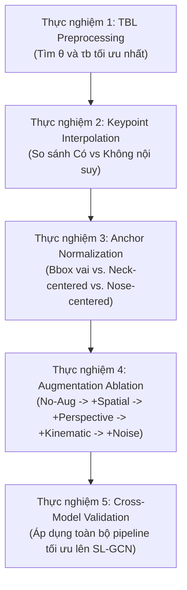

# Kế hoạch Thực nghiệm & Phân tích Tối ưu hóa Pipeline Nhận diện VSL
*(Tài liệu Context phục vụ cho các Session tiếp theo)*

---

## 1. Hiện trạng Kiến trúc Dự án (Codebase Audit)
Dự án đã được đồng bộ hóa và làm sạch trong tệp [architecture_analysis.md](VietnameseSignLanguageRecognition/docs/architecture_analysis.md) với các điểm cốt lõi:
- **Mô hình hỗ trợ huấn luyện cục bộ (Train từ đầu):** Chỉ có **SPOTER** (Pose-based) và **VideoMAE** (RGB-based) là có mã nguồn mô hình đầy đủ tại `src/models/`.
- **Mô hình phục vụ suy diễn (Inference/Evaluation):** **SL-GCN** và các mô hình khác đã lược bỏ định nghĩa local, thay vào đó mô hình được tải động từ checkpoint/Hugging Face Hub thông qua cờ `trust_remote_code=True` hoặc chạy bằng local ONNX runtime.
- **Tiền xử lý cục bộ:** Đã cấu trúc lại dự án theo hướng thuần offline/cục bộ (không đẩy kết quả lên HF Hub, tắt Wandb, tự động ánh xạ nhãn từ file JSON metadata nếu thiếu `gloss.csv`). Các pipeline ONNX tự tìm kiếm tệp tin checkpoint `.onnx` ở thư mục local thay vì tải từ Hub.

---

## 2. Đối chiếu & Phân tích Phương pháp luận (Comparative Literature Review)

### A. Bài báo VSL400 (`vsl400_dataset.pdf`):
- **Quy mô:** 74,259 clips, 400 từ, 28 người ký, tri-view synchronized.
- **Tiền xử lý:** TBL (góc khuỷu tay $\theta = 160^\circ$, số frame duy trì $N = 20$, trễ đệm $\tau_b = 400\text{ ms}$) và BGSP (lọc thời lượng $\tau_{min} = 0.67\text{ s}$, crop $1080 \times 1080$).
- **Hạn chế nghiên cứu:** Chỉ sử dụng một bộ tham số tiền xử lý cố định, chưa chạy ablation study để chứng minh tính tối ưu của các ngưỡng toán học này đối với mô hình nhận diện hạ nguồn.
- **Phân tách dữ liệu:** Sử dụng cơ chế chia **Signer-disjoint** (người ký độc lập) để đánh giá.

### B. Bài báo QIPEDC VSL (`IJSRED-V9I1P55.pdf`):
- **Quy mô:** 6,046 videos, 3,782 từ (64% từ chỉ có duy nhất 1 mẫu huấn luyện), 11 người ký.
- **Kỹ thuật nổi bật:**
  - **Nội suy Keypoint (Interpolation):** Điền khuyết các keypoint bị thiếu (confidence < 0.5) bằng nội suy tuyến tính/spline dựa trên các frame lân cận.
  - **Chuẩn hóa chuỗi thời gian:** Zero-padding nếu ngắn hơn 60 frames, downsampling đều nếu dài hơn 60 frames.
  - **Tăng cường:** Spatial (Crop tỷ lệ 0.85, Zoom 1.2x, Rotate $\pm 8^\circ$), Geometric (**Perspective skew** phối cảnh hệ số 0.10).
  - **Facial Landmarks:** Chứng minh việc đưa facial keypoint (eyebrows, mouth, eyes) giúp tăng độ chính xác từ $3.67\%$ đến $8.81\%$.
  - **Đánh giá:** So sánh giữa Vocabulary-Coverage-First (chia stratified tránh rò rỉ dữ liệu tăng cường) và Leave-One-Signer-Out (LOSO).

---

## 3. Khung Thiết kế Thực nghiệm (Greedy Ablation Study Design)
Để tránh bùng nổ tổ hợp phép thử (160 runs $\approx$ 40 ngày chạy), chúng ta áp dụng mô hình thực nghiệm tiệm tiến (Greedy) gồm 17 runs trên mô hình SPOTER (sau đó xác thực chéo trên SL-GCN):

### Chi tiết các đầu mục cần phát triển thêm (New Implementation Tasks):
1. **Keypoint Reconstruction:** Xây dựng class `PoseInterpolate` tại `src/features/transforms/base.py` hoặc trong loader để nội suy tuyến tính lấp đầy các tọa độ $(0,0)$ có độ tin cậy thấp.
2. **Anchor-based Normalization:** Tạo thêm các phương thức chuẩn hóa mới:
   - Dịch chuyển tâm gốc tọa độ về **Neck (Cổ)** hoặc **Nose (Mũi)** thay vì bounding box động của cơ thể.
3. **Perspective Skew:** Kích hoạt và kiểm thử chế độ phối cảnh `"perspective"` hiện đang bị comment trong `SPOTERShear` và `SPOTERRandomAugment`.
4. **Facial Features:** Thử nghiệm đưa thêm các điểm neo khuôn mặt (eyebrows, mouth, eyes) vào `SPOTERJointSelect`.

---

## 4. Tài nguyên & Phương án Huấn luyện (Resource & Execution Plan)
- **Cục bộ (Mac GPU - MPS):** 
  - Tốc độ huấn luyện: ~3.5 phút/epoch (gồm cả validation).
  - Thời gian huấn luyện 1 run (100 epochs): **~5.8 giờ**.
  - Tổng 17 runs thực nghiệm: **~98 giờ** (quá tải đối với máy cá nhân).
- **Khuyến nghị sử dụng Kaggle 2x T4 GPU:**
  - Tốc độ huấn luyện: ~1 phút/epoch (với PyTorch DDP).
  - Thời gian huấn luyện 1 run: **~1 - 1.5 giờ**.
  - Tận dụng cơ chế chạy song song (Parallel Notebooks) trên Kaggle để chạy 17 runs trong **dưới 24 giờ**.

---

## 5. Hướng dẫn cho Agent trong Session mới
Khi tiếp quản công việc từ tài liệu này, hãy:
1. Đọc và phân tích các file:
   - [spoter.py (transforms)](VietnameseSignLanguageRecognition/src/features/transforms/spoter.py)
   - [spoter.py (augmentations)](VietnameseSignLanguageRecognition/src/features/augmentations/spoter.py)
   - [arguments.py](VietnameseSignLanguageRecognition/src/configs/arguments.py)
2. Bắt đầu viết module nội suy keypoint tuyến tính (`PoseInterpolate`) tại `src/features/transforms/base.py`.
3. Bắt đầu chỉnh sửa hoặc bổ sung các lớp chuẩn hóa theo điểm neo cổ/mũi (`SPOTERSingleBodyDictNormalize`).
4. Viết script tự động hóa grid-search các tham số TBL chạy trên Kaggle và xuất báo cáo markdown thống kê kết quả.
