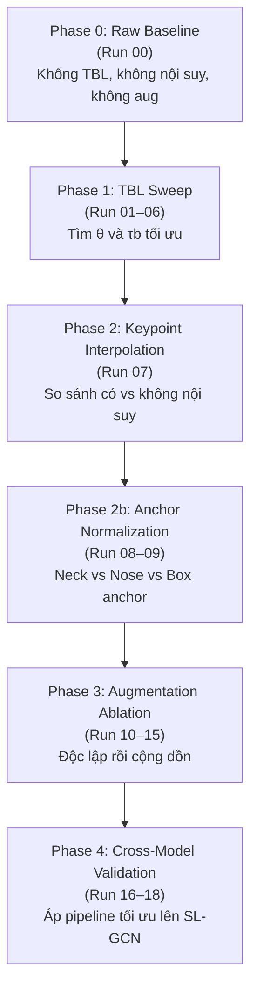

# Thiết kế Thực nghiệm Ablation Study — VSL Keypoint Pipeline

> Tài liệu mô tả phương pháp, thiết kế thực nghiệm và kết quả greedy ablation study được thực hiện để xác định pipeline tiền xử lý keypoint tối ưu cho bài toán nhận dạng từ ký hiệu tiếng Việt (Isolated Word-Level VSL Recognition).

---

## 1. Bối cảnh và Động lực

Bài báo VSL400 gốc (Nguyen Quoc et al., 2026) sử dụng một bộ tham số tiền xử lý cố định cho thuật toán TBL và BGSP mà chưa có ablation trực tiếp trên mô hình nhận dạng hạ nguồn. Cụ thể:

- Ngưỡng góc khuỷu tay `θ = 160°` và trễ đệm `τb = 400ms` được chọn theo kinh nghiệm.
- Chưa có đánh giá tác động của keypoint interpolation, anchor normalization, augmentation và facial landmarks trên tập dữ liệu VSL400.

Ablation study này nhằm:

1. **Kiểm chứng** tham số TBL mặc định so với các giá trị thay thế.
2. **Đo lường tác động riêng lẻ** của từng kỹ thuật tiền xử lý: nội suy keypoint, chuẩn hóa theo điểm neo, tăng cường dữ liệu, facial landmarks.
3. **Xác thực chéo** pipeline tối ưu trên mô hình SL-GCN.

---

## 2. Thiết lập Thực nghiệm

| Mục | Thông số |
| :--- | :--- |
| **Dataset** | VSL400 · Subset: cam_1 · 400 gloss · 28 signers |
| **Split Protocol** | Signer-disjoint (`visl_400.py`, seed=42) |
| **Mô hình (Phase 0–3)** | SPOTER · hidden_dim=108 · 9 heads · 6 enc/dec layers |
| **Mô hình (Phase 4)** | SL-GCN · 27 keypoints |
| **Số epoch** | 100 · LR cosine decay · warmup_ratio=0.05 |
| **Batch size** | Train: 64 · Val/Test: 128 |
| **Optimizer** | AdamW · lr=5e-4 · weight_decay=0.01 |
| **Metric chính** | Top-1 Accuracy + Macro F1 (Val & Test) |
| **Phần cứng** | Mac MPS (M4) · ~3.5 phút/epoch · ~5.8 giờ/run |
| **Seed** | 1 seed duy nhất (seed=42) |

> ⚠️ **Giới hạn thực nghiệm:** Do mỗi run mất ~5.8 giờ, một số runs trong Phase 1 và Phase 4 chưa được thực thi. Kết quả hiện có là **11/19 runs**. Xem chi tiết tại [ablation_study_report.md](ablation_study_report.md).

---

## 3. Thiết kế Greedy Ablation (19 Runs)

Thay vì grid search đầy đủ (160+ runs ≈ hàng tháng chạy), thiết kế này áp dụng mô hình tiệm tiến (greedy): mỗi phase tìm cấu hình tốt nhất rồi dùng nó làm nền cho phase tiếp theo.



### Bảng 19 Runs

| Run | Phase | Cấu hình | Trạng thái |
| :--- | :--- | :--- | :--- |
| Run 00 | Phase 0 | Raw Baseline (không TBL, không aug) | ✅ Completed |
| Run 01 | Phase 1 | TBL: θ=140°, τb=400ms | ❌ Failed |
| Run 02 | Phase 1 | TBL: θ=150°, τb=400ms | ⏳ Missing |
| Run 03 | Phase 1 | TBL: θ=160°, τb=400ms (default) | ✅ Completed |
| Run 04 | Phase 1 | TBL: θ=170°, τb=400ms | ⏳ Missing |
| Run 05 | Phase 1 | TBL: θ=160°, τb=200ms | ⏳ Missing |
| Run 06 | Phase 1 | TBL: θ=160°, τb=600ms | ⏳ Missing |
| Run 07 | Phase 2 | + Keypoint Interpolation (Box anchor) | ✅ Completed |
| Run 08 | Phase 2b | + Interpolation + Neck Anchor | ✅ Completed |
| Run 09 | Phase 2b | + Interpolation + Nose Anchor | ✅ Completed |
| Run 10 | Phase 3 | Spatial Aug only (Rotate + Squeeze) | ✅ Completed |
| Run 11 | Phase 3 | Perspective Skew only | ✅ Completed |
| Run 12 | Phase 3 | Kinematic Aug only (ArmJointRotate) | ✅ Completed |
| Run 13 | Phase 3 | Gaussian Noise only | ✅ Completed |
| Run 14 | Phase 3 | Combined (Spatial + Perspective + Kinematic + Noise) | ✅ Completed |
| Run 15 | Phase 3 | Combined + Facial Landmarks | ✅ Completed |
| Run 16 | Phase 4 | SL-GCN Baseline | ⏳ Missing |
| Run 17 | Phase 4 | SL-GCN + Interpolation + Best TBL | ⏳ Missing |
| Run 18 | Phase 4 | SL-GCN + Interpolation + Best TBL + Face | ⏳ Missing |

---

## 4. Phương pháp Triển khai

### 4.1 Sinh cấu hình tự động

19 file YAML cấu hình được sinh tự động bằng script:

```bash
python3 generate_ablation_configs.py
# Output: src/configs/ablation/run_00.yaml → run_18.yaml
```

Mỗi file YAML kế thừa cấu hình SPOTER chuẩn và chỉ override các tham số khác nhau giữa các runs.

### 4.2 Chạy từng run

```bash
# Chạy một run cụ thể
python3 run_ablation.py --run_id 8

# Kiểm tra dataset & model load trước khi chạy đầy đủ
python3 run_ablation.py --run_id 8 --dry_run

# Override epoch để debug nhanh
python3 run_ablation.py --run_id 8 --epochs 1

# Resume từ checkpoint
python3 run_ablation.py --run_id 8 --resume
```

Sau khi hoàn tất, kết quả được lưu tự động tại `experiments/ablation_results/run_XX.json`.

### 4.3 Tổng hợp báo cáo

```bash
python3 generate_ablation_report.py
# Output: docs/ablation_study_report.md
```

Script đọc tất cả file `run_XX.json` trong `experiments/ablation_results/` và tổng hợp thành báo cáo Markdown.

> **Lưu ý:** File JSON kết quả được lưu ở `experiments/ablation_results/` (do `run_ablation.py` tạo), không phải trong thư mục checkpoint `experiments/ablation/run_XX/`. Nếu chạy thủ công bên ngoài `run_ablation.py`, cần copy file JSON vào đúng thư mục.

---

## 5. Tài nguyên & Chi phí Thực nghiệm

| Môi trường | Tốc độ/epoch | Thời gian/run (100 epochs) | Tổng 19 runs |
| :--- | :--- | :--- | :--- |
| Mac MPS (M4) | ~3.5 phút | ~5.8 giờ | ~110 giờ |
| Kaggle 2×T4 GPU | ~1 phút | ~1.5 giờ | ~28 giờ |

Trong ablation study này, 11 runs đã được thực hiện trên Mac MPS (M4). Các runs còn lại chưa hoàn tất do giới hạn thời gian. Xem kết quả chi tiết tại [ablation_study_report.md](ablation_study_report.md).

---

## 6. Pipeline Được Đề Xuất

Dựa trên 11 runs đã hoàn tất, pipeline tốt nhất được xác định là cấu hình **Run 08** (Neck Anchor Normalization + Keypoint Interpolation) đạt Test Accuracy cao nhất (84.08%):

```
1. TBL Segmentation    (θ=160°, τb=400ms, N=20)
2. Keypoint Extraction (MediaPipe Holistic)
3. PoseInterpolate     (confidence_threshold=0.5)
4. SPOTERJointSelect   (54 khớp: 12 body + 42 hand)
5. Neck Anchor Norm    (anchor="neck", scale=neck-nose distance)
6. Hand Wrist Norm     (shift về tọa độ cổ tay)
7. SPOTERPad           (96 frames, cycle-pad)
8. SPOTERShift         ([0,1] → [-0.5, 0.5])
```

*Augmentation (Spatial + Perspective + Kinematic + Gaussian) chỉ áp dụng khi train, không đưa vào keypoint dataset tĩnh.*

> **Giới hạn:** Pipeline trên dựa trên 11/19 runs. Tham số TBL (θ, τb) chưa được tối ưu hóa bằng grid search đầy đủ vì Phase 1 chỉ hoàn tất run θ=160°. Người dùng được khuyến nghị chạy thêm ablation trên dữ liệu riêng.

---

## 7. Công việc Còn Lại

| Hạng mục | Mô tả | Ưu tiên |
| :--- | :--- | :--- |
| Hoàn tất Phase 1 | Chạy Run 02, 04, 05, 06 để xác định θ và τb tối ưu thực sự | Cao |
| Hoàn tất Phase 4 | Chạy Run 16, 17, 18 để xác nhận chéo trên SL-GCN | Trung bình |
| Multi-seed | Lặp lại các runs với ≥3 seed để có error bar | Trung bình |
| Facial với model lớn | Thử `hidden_dim=148` với Neck Anchor + Combined Aug | Thấp |
| Multi-view | Mở rộng sang cam_2, cam_3 | Thấp |

---

## 8. Tham khảo

| Ký hiệu | Công trình |
| :--- | :--- |
| VSL400 (2026) | Nguyen Quoc et al., "A Multi-view Dataset for Vietnamese Word-Level Sign Language Recognition", Zenodo DOI: 10.5281/zenodo.17943574 |
| SPOTER (2022) | Boháček & Hrúz, "Sign Pose-Based Transformer for Word-Level Sign Language Recognition", WACV Workshops |
| Roh et al. (2024) | Roh et al., "Preprocessing Mediapipe Keypoints with Keypoint Reconstruction and Anchors for Isolated Sign Language Recognition", SignLang @ LREC-COLING |
| QIPEDC-VSL (2026) | H. M. Dung, N. V. Hung, N. K. Dang, P. T. H. Nhai, "Towards Realistic Vietnamese Sign Language Recognition: A Large-Scale Dataset and Rigorous Evaluation Protocol", *IJSRED* Vol. 9 No. 1, 2026 |
| OpenHands (2022) | Selvaraj et al., "OpenHands: Making Sign Language Recognition Accessible with Pose-based Pretrained Models", ACL |
